## 模板

### 快速排序算法模板

——分治

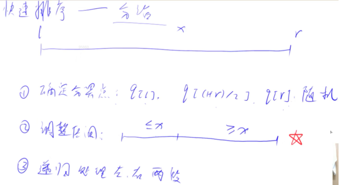

②的实现

1）暴力——开辟额外空间：

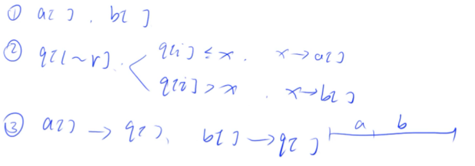


2）双指针  

```cpp
void quick_sort(int q[], int l, int r)
{
    if (l >= r) return;
    
    int i = l - 1, j = r + 1, x = q[l];
    while (i < j)
    {
        do i ++ ; while (q[i] < x);
        do j -- ; while (q[j] > x);
        if (i < j) swap(q[i], q[j]);
        else break;
    }
    quick_sort(q, l, j), quick_sort(q, j + 1, r);
}
```

### 归并排序算法模板

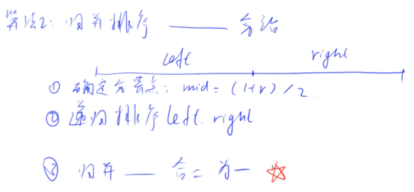

```cpp
void merge_sort(int q[], int l, int r)
{
    if (l >= r) return;
    
    int mid = l + r >> 1;
    merge_sort(q, l, mid);
    merge_sort(q, mid + 1, r);
    
    int k = 0, i = l, j = mid + 1;
    while (i <= mid && j <= r)
        if (q[i] < q[j]) tmp[k ++ ] = q[i ++ ];
        else tmp[k ++ ] = q[j ++ ];
    
    while (i <= mid) tmp[k ++ ] = q[i ++ ];
    while (j <= r) tmp[k ++ ] = q[j ++ ];
    
    for (i = l, j = 0; i <= r; i ++, j ++ ) q[i] = tmp[j];
}
```

### 整数二分算法模板

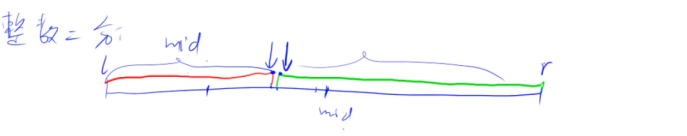


有**单调性**可以二分，题目不一定有单调性。两者无决定关系。

如果找到一个性质可以将整个区间一分为二，二分可寻找划分边界。 

```cpp
bool check(int x) {/* ... */} // 检查x是否满足某种性质
```

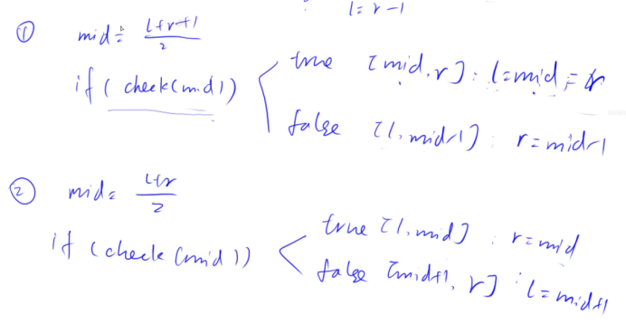


每次**选择答案所在**的区间进行下一步处理。直至区间长度为1。（二分一定有解，题目不一定有解。因为定义边界，二分能够算出中点。）

区间[l, r]被划分成[l, mid]和[mid + 1, r]时使用：

```cpp
int bsearch_1(int l, int r)
{
    while (l < r)
    {
        int mid = l + r >> 1;
        if (check(mid)) r = mid;    // check()判断mid是否满足性质
        else l = mid + 1;
    }
    return l;
}
```

区间[l, r]被划分成[l, mid - 1]和[mid, r]时使用：

```cpp
int bsearch_2(int l, int r)
{
    while (l < r)
    {
        int mid = l + r + 1 >> 1;
        if (check(mid)) l = mid;
        else r = mid - 1;
    }
    return l;
}
```

### 浮点数二分算法模板

精度经验值  **多2**：

保留6位小数   r-l > 1e-8

保留4位小数   r-l > 1e-6

保留5位小数   r-l > 1e-7

```cpp
bool check(double x) {/* ... */} // 检查x是否满足某种性质
```

```cpp
double bsearch_3(double l, double r)
{
    const double eps = 1e-6;   // eps 表示精度，取决于题目对精度的要求
    while (r - l > eps)
    {
        double mid = (l + r) / 2;
        if (check(mid)) r = mid;
        else l = mid;
    }
    return l;
}
```

### 高精度加法

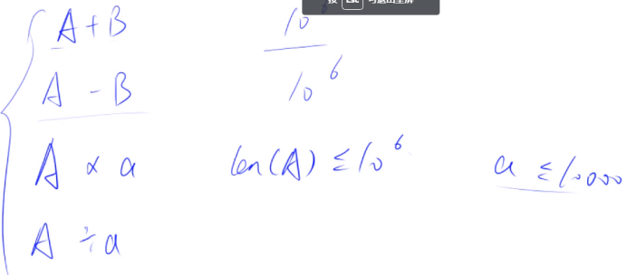


**大整数存储**

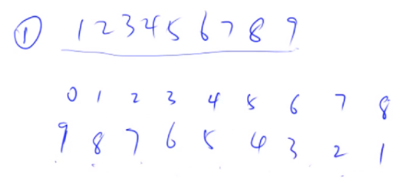


逆存，进位、高位补数更方便操作。


// C = A + B, A >= 0, B >= 0

```cpp
vector<int> add(vector<int> &A, vector<int> &B)
{
    if (A.size() < B.size()) return add(B, A);
    
    vector<int> C;
    int t = 0;
    for (int i = 0; i < A.size(); i ++ )
    {
        t += A[i];
        if (i < B.size()) t += B[i];
        C.push_back(t % 10);
        t /= 10;
    }
    
    if (t) C.push_back(t);
    return C;
}
```

### 高精度减法

(需转为 A>=B)

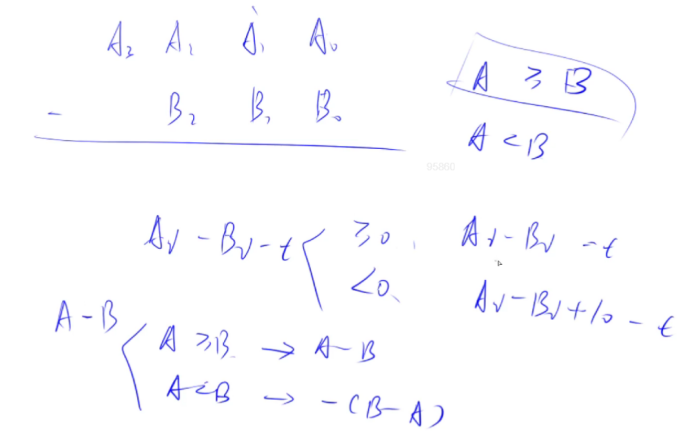


若有**负数**，则两数相减A-B，一定可以转换成|A|-|B|或|A|+|B|，分情况讨论。

// C = A - B, 满足A >= B, A >= 0, B >= 0

```cpp
vector<int> sub(vector<int> &A, vector<int> &B)
{
    vector<int> C;
    for (int i = 0, t = 0; i < A.size(); i ++ )
    {
        t = A[i] - t;
        if (i < B.size()) t -= B[i];
        C.push_back((t + 10) % 10);
        if (t < 0) t = 1;
        else t = 0;
    }

    while (C.size() > 1 && C.back() == 0) C.pop_back();
    return C;
}
```

### 高精度乘低精度


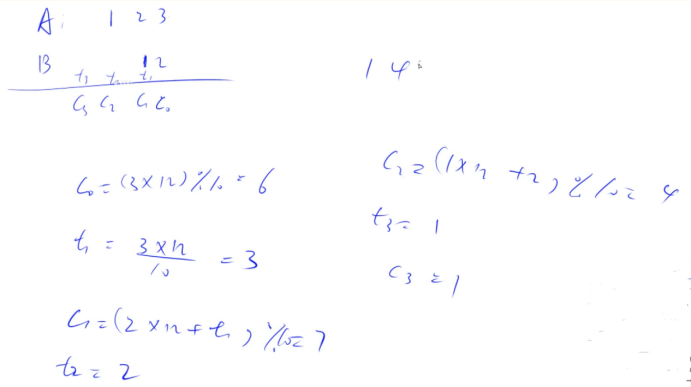

// C = A * b, A >= 0, b > 0

```cpp
vector<int> mul(vector<int> &A, int b)
{
    vector<int> C;
    int t = 0;
    for (int i = 0; i < A.size() || t; i ++ )
    {
        if (i < A.size()) t += A[i] * b;
        C.push_back(t % 10);
        t /= 10;
    }
    
    return C;
}
```

高精度乘高精度——[LeetCode43](https://leetcode-cn.com/problems/multiply-strings/)

### 高精度除以低精度

区别前者，从最高位开始算。

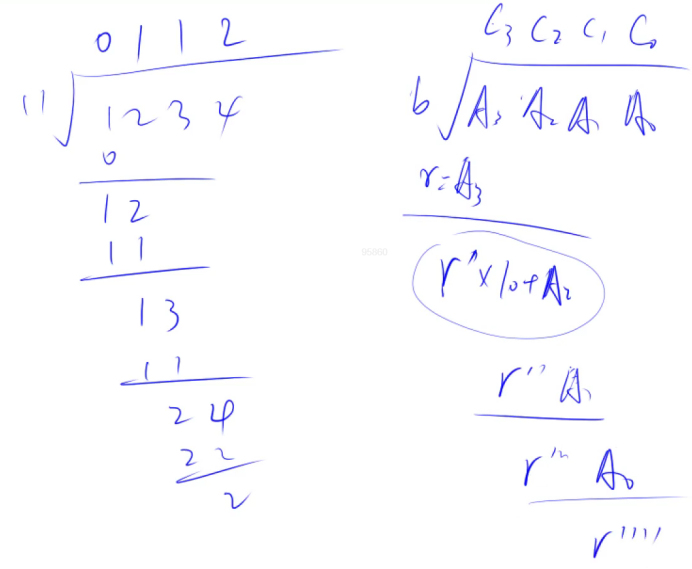

// A / b = C ... r, A >= 0, b > 0
```cpp
vector<int> div(vector<int> &A, int b, int &r)
{
    vector<int> C;
    r = 0;
    for (int i = A.size() - 1; i >= 0; i -- )
    {
        r = r * 10 + A[i];
        C.push_back(r / b);
        r %= b;
    }
    reverse(C.begin(), C.end());
    while (C.size() > 1 && C.back() == 0) C.pop_back();
    return C;
}
```

### 一维前缀和

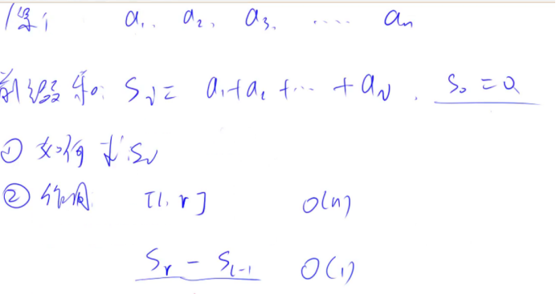

```cpp
S[i] = a[1] + a[2] + ... a[i]
a[l] + ... + a[r] = S[r] - S[l - 1]
```

### 二维前缀和

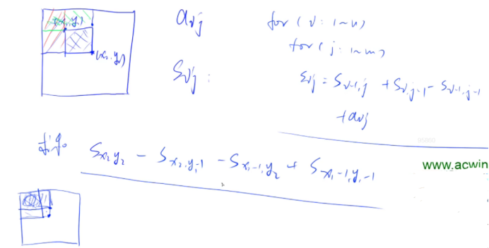

```cpp
S[i, j] = 第i行j列格子左上部分所有元素的和
以(x1, y1)为左上角，(x2, y2)为右下角的子矩阵的和为 S[x2, y2] - S[x1 - 1, y2] - S[x2, y1 - 1] + S[x1 - 1, y1 - 1]
```

### 一维差分

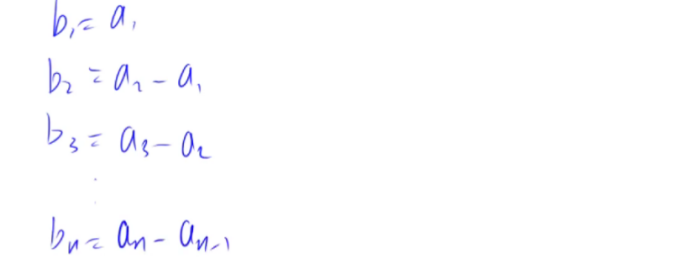

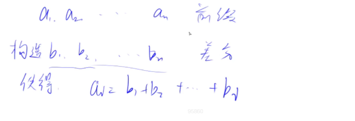

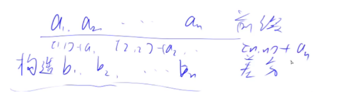

完成+c ——> 只要O(1)时间去给原数组中间某一个连续区间全加一个固定值。

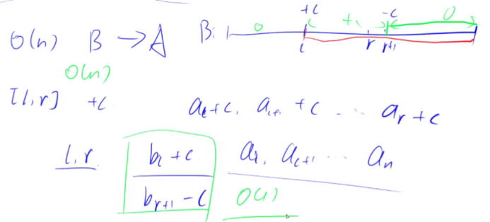

```cpp
B[i] = a[i] - a[i - 1]
给区间[l, r]中的每个数加上c：B[l] += c, B[r + 1] -= c
```

### 二维差分

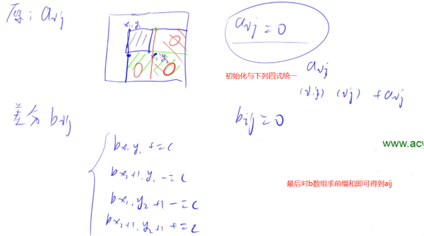

(a数组是b数组的前缀和)

```cpp
给以(x1, y1)为左上角，(x2, y2)为右下角的子矩阵中的所有元素加上c：
S[x1, y1] += c, S[x2 + 1, y1] -= c, S[x1, y2 + 1] -= c, S[x2 + 1, y2 + 1] += c
```

### 双指针

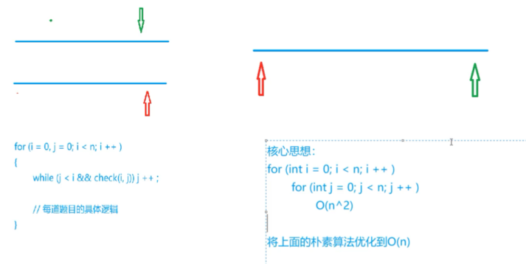

```cpp
for (int i = 0, j = 0; i < n; i ++ )
{
    while (j < i && check(i, j)) j ++ ;
    // 具体问题的逻辑
}
常见问题分类：
		(1) 对于一个序列，用两个指针维护一段区间
		(2) 对于两个序列，维护某种次序，比如归并排序中合并两个有序序列的操作
```

### 位运算

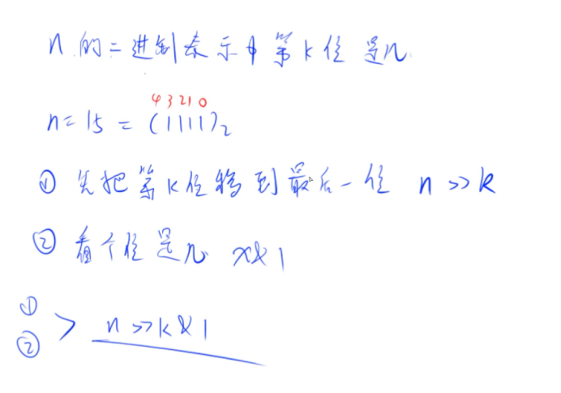

> 10
>
> for(int k = 3;k >= 0;k--) cout << (n>>k&1)<<endl;
>
> 1010

**lowbit(x)**


0000 0011=3，它的相反数为-3=1000 0011，但0000 0011 + 1000 0011 != 0000 0000。计算机就引入了**补码**，相当于上面的相反数的表示。将人容易理解的二进制称为**原码**，计算机实际使用时用的是补码。**正数的补码就是自己，负数的补码为按位取反加1**。

对于1000 0011来说，若其为原码，则表示-3；若其为补码，则表示(-1)*2^7 + 1*2^1 + 1*2^0 = -125。

应用：求x里面1的个数。

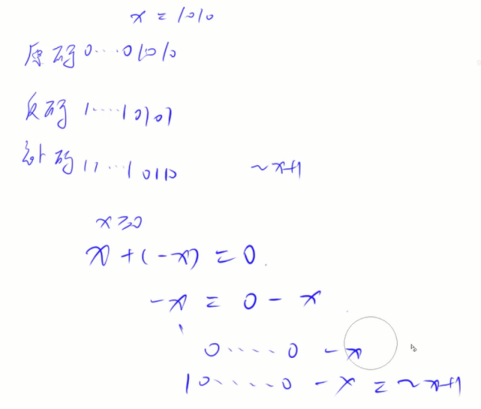

```cpp
求n的第k位数字: n >> k & 1
返回n的最后一位1：lowbit(n) = n & -n
```

### 离散化

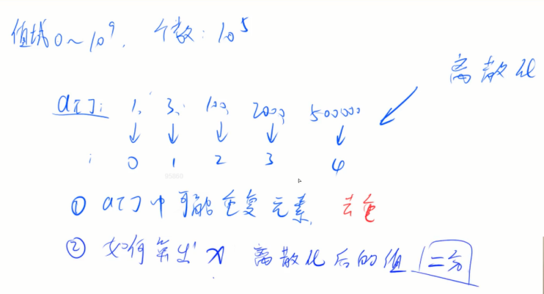


```cpp
vector<int> alls; // 存储所有待离散化的值
sort(alls.begin(), alls.end()); // 将所有值排序
alls.erase(unique(alls.begin(), alls.end()), alls.end());	// 去掉重复元素

// 二分求出x对应的离散化的值
int find(int x)
{
int l = 0, r = alls.size() - 1;
while (l < r)
{
int mid = l + r >> 1;
if (alls[mid] >= x) r = mid;
else l = mid + 1;
}
return r + 1;
}
```

### 区间合并

```cpp
// 将所有存在交集的区间合并
void merge(vector<PII> &segs)
{
    vector<PII> res;

    sort(segs.begin(), segs.end());

    int st = -2e9, ed = -2e9;
    for (auto seg : segs)
        if (ed < seg.first)
        {
            if (st != -2e9) res.push_back({st, ed});
            st = seg.first, ed = seg.second;
        }
        else ed = max(ed, seg.second);

    if (st != -2e9) res.push_back({st, ed});

    segs = res;
}
```


## 题目

### 快速排序

#### AcWing 785. 快排实例

**输入**

```
5
3 1 2 4 5
```
**解析**

注意**边界问题**。下面用**j**，上面不能取到 **q[r]**。下面用**i**,上面不能取到 **q[l]**，可能出现 ∅和[0,1]的死循环。可以用q[r]或q[(l+r)/2]。

```cpp

#include <iostream>
using namespace std;

const int N = 1e6+10;
int n;
int q[N];

void quick_sort(int l,int r)
{
    if(l >= r)  return;             ////补等于号
    int x = q[(l+r)/2],i = l-1,j = r+1;     //x应当固定q
    while(i < j)
    {
        do i++;while(q[i]<x);
        do j--;while(q[j]>x);
        if(i < j)   swap(q[i],q[j]);
    }
    quick_sort(l,j);
    quick_sort(j+1,r);
}

int main()
{
    scanf("%d", &n);
    for (int i = 0; i < n; i ++ ) scanf("%d", &q[i]);
    
    quick_sort(0,n-1);
    
    for (int i = 0; i < n; i ++ ) printf("%d ",q[i]);
    return 0;
}
```

**改进**的快排
```cpp
#include <bits/stdc++.h>
using namespace std;

const int N = 1e6+10;
int n;

void swap(vector<int>& arr, int i, int j)
{
	int tmp = arr[i];
	arr[i] = arr[j];
	arr[j] = tmp;
}

vector<int> partiton(vector<int>& arr, int l, int r)	//荷兰国旗问题
{
	int less = l - 1;
	int more = r;
	while (l<more)
	{
		if (arr[l] < arr[r])
		{
			swap(arr, ++less, l++);
		}
		else if (arr[l] > arr[r])
		{
			swap(arr, --more, l);
		}
		else
		{
			l++;
		}
	}
	swap(arr, more, r);			//默认以arr[r]做划分，不可遗漏最后一位数！
	return { less + 1,more };
}

void quickSort(vector<int>& arr, int l, int r)		//改进的快排，随机取数字做划分值
{
	if (l < r)
	{
		swap(arr, l + rand() % (r - l + 1), r);		
		vector<int>p = partiton(arr, l, r);	//返回划分区域（如[5 5 5]）的左边界和右边界
		quickSort(arr, l, p[0] - 1);	//<区
		quickSort(arr, p[1] + 1, r);	//>区
	}
}

int main()
{
    scanf("%d", &n);
    vector<int> q(n);
    for (int i = 0; i < n; i ++ ) scanf("%d", &q[i]);
    
    quickSort(q,0,n-1);
    
    for (int i = 0; i < n; i ++ ) printf("%d ",q[i]);
    return 0;
}
```
#### AcWing 786. 第k个数

**输入**

```
5 3
2 4 1 5 3
```

**输出**

`3`

**解析**


```cpp
#include<bits/stdc++.h>
using namespace std;

void quick_sort(vector<int>&q,int l,int r)
{
    while(l >= r)   return;
    int x = q[l+(r-l>>1)],i = l-1,j =r+1;       //注意(r-l>>1)括号位置。
    while(i < j)
    {
        do ++i;while(q[i]<x);
        do --j;while(q[j]>x);
        if(i < j)   swap(q[i],q[j]);        
    }
    quick_sort(q,l,j);
    quick_sort(q,j+1,r);

}

int main()
{
    int n,k;
    scanf("%d%d", &n, &k);
    vector<int>q(n);
    for(int i = 0;i < n;++i)    scanf("%d", &q[i]);
    quick_sort(q,0,n-1);
    printf("%d",q[k-1]);
    return 0;
}
```
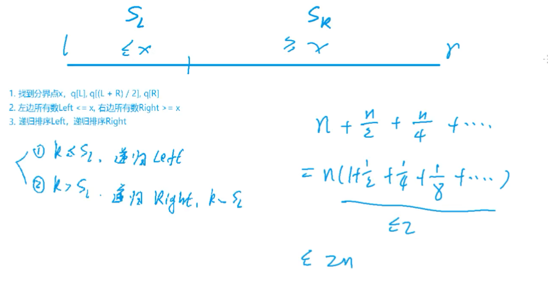 
降低复杂度。若左边数量已大于k，则只对左边进行排序；否则对右边。**分治**
```cpp
#include <iostream>
#include <cstring>
#include <algorithm>
// #include<bits/stdc++.h>
using namespace std;
const int N = 100010;
int n,k;
int q[N];

int quick_sort(int q[],int l,int r,int k)
{
    if(l >= r)      // if(l == r)
        return q[l];
    int x = q[(l+r)>>1],i = l-1,j = r+1;
    while(i < j)
    {
        do ++i;while(q[i] < x);     //while(q[++i] < x)
        do --j;while(q[j] > x);     //while(q[--j] > x)
        if(i < j)   swap(q[i],q[j]);
    }
    int sl = j - l + 1;
    if(k <= sl)  quick_sort(q,l,j,k);
    else    return quick_sort(q,j+1,r,k-sl);
}

int main()
{
    scanf("%d%d",&n,&k); 
    for (int i = 0; i < n; i ++ )   scanf("%d",&q[i]);
    cout << quick_sort(q,0,n-1,k)<<endl;
    
    return 0;
}
```


### 归并排序

#### AcWing 787. 归并排序

**输入**

```
5
3 1 2 4 5
```

**输出**

`1 2 3 4 5`

**解析**

归并排序：
1.确定分界点
2.递归排序
3.归并————合二为一

```cpp
#include<bits/stdc++.h>
using namespace std;
int n;    
int N = 100010;
vector<int>tmp(N);
vector<int>q(N);
void merge_sort(vector<int>&q,int l,int r)  //闭区间
{
    if(l >= r)  return;
    int mid = l+(r-l>>1);   //或 l+r>>1
    merge_sort(q,l,mid);
    merge_sort(q,mid+1,r);
    
    int k = 0,i = l,j = mid+1;
    while(i <= mid && j <= r)
    {
        if(q[i] < q[j]) tmp[k++] = q[i++];
        else tmp[k++] = q[j++];
    }
    while(i <= mid) tmp[k++] = q[i++];
    while(j <= r)   tmp[k++] = q[j++];
    for (int i = l,j = 0; i <= r; i ++,j++ )    q[i] = tmp[j];  //注意q[i]条件 
}
int main()
{
    scanf("%d", &n);
    for (int i = 0; i < n; i ++ ) scanf("%d", &q[i]);
    
    merge_sort(q,0,n-1);
    
    for (int i = 0; i < n; i ++ ) printf("%d ",q[i]);
}
```
#### AcWing 788. 逆序对的数量

**输入**

```
6
2 3 4 5 6 1
```

**输出**

`5`

**解析**

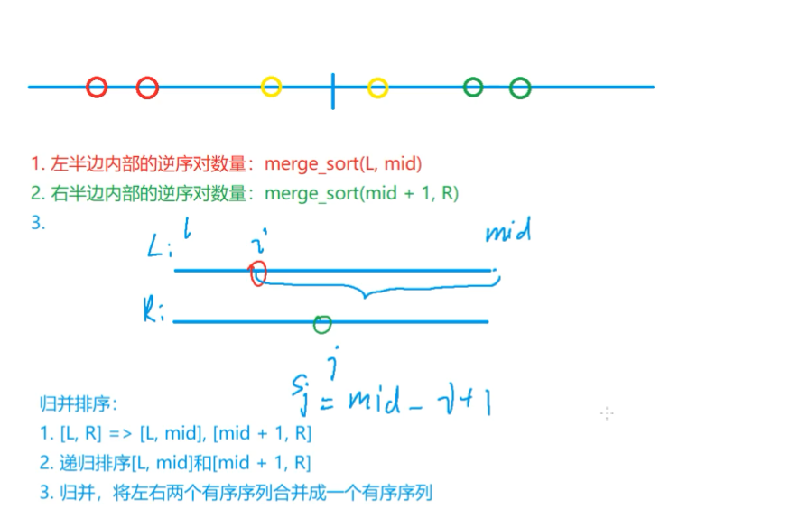 
4 5 6 | 1 2 3
当你发现 4 比 3 大的时候，也就是说右边最大的元素都小于左边最小的元素，那么左边剩下的5和6都必然比右边的所有元素大。因此就可以不用数5和6的情形了，直接分别加上右半边的元素个数就可以了，这一步就降低到了**O(n)**
即 位置6(mid) - 位置4(i) + 1。为3的情况。


```cpp
#include <iostream>
#include <cstring>
#include <algorithm>
using namespace std;

const int N = 100010;
int n;
int q[N];
int tmp[N];
unsigned long res = 0;      //int则溢出

void merge_sort(int q[],int l,int r)
{
    if(l >= r)  return;
    int mid = l+r >> 1;
    
    merge_sort(q,l,mid);
    merge_sort(q,mid+1,r);
    
    int k = 0,i = l,j = mid+1;
    
    while(i <= mid && j <= r)
    {
        if(q[i] <= q[j]) tmp[k++] = q[i++];
        else    
        {
            tmp[k++] = q[j++];
            res +=( mid - i + 1);       //逆序对对比归并排序只加了这一句。 //是i,非l
        }
    }
    while(i <= mid) tmp[k++] = q[i++];
    while(j <= r)   tmp[k++] = q[j++];
    
    for (int i = l,j = 0; i <= r; i ++,j++ )     q[i] = tmp[j];
}

int main()
{
    scanf("%d", &n);
    for (int i = 0; i < n; i ++ )   scanf("%d",&q[i]);
    
    merge_sort(q,0,n-1);
    
    cout<<res<<endl;
    
    return 0;
}
```


### 二分

#### AcWing 789. 数的范围

**输入样例**

```
6 3
1 2 2 3 3 4
3
4
5
```

**输出样例**

```
3 4
5 5
-1 -1
```

**解析**

```cpp
#include <iostream>
#include <cstring>
#include <algorithm>
using namespace std;

const int N = 100010;
int n,k;
int q[N];

int main()
{
    scanf("%d%d",&n,&k);
    for (int i = 0; i < n; i ++ )   scanf("%d",&q[i]);
    
    while(k --)
    {
        int x;
        scanf("%d", &x);
        
        int l = 0,r = n-1;
        while(l < r)
        {
            int mid = l+r >> 1;
            if(q[mid] >= x) r = mid;        //注意是q[mid]而非mid
            else    l = mid+1;
        }
        if(q[l]!=x) cout<<"-1 -1"<<endl;
        else
        {
            cout << l <<' ';
           
            int l = 0,r = n-1;
            while(l <r)
            {
                int mid = l+r+1 >> 1;
                if(q[mid] <= x) l = mid;
                else    r = mid-1;
            }
            cout<< l << endl;
        }
    }
    return 0;
}


```
另：
二分应用
[0～n-1中缺失的数字](https://leetcode-cn.com/problems/que-shi-de-shu-zi-lcof/) 
```cpp
int l = 0,r = nums.size()-1;
while(l <= r)
{
    int mid = l+r>>1;
    if(nums[mid]==mid)  l = mid+1;
    else    r = mid-1;          //这里减一，while内加 = 不再死循环
}
```
亦可
```
int l = 0,r = nums.size();      //-1是不会执行循环的
while(l < r)
{
    int mid = l+r>>1;
    if(nums[mid]==mid)  l = mid+1;
    else    r = mid;
}
```
#### AcWing 790. 数的三次方根

**输入样例**

```
1000.00
```

**输出样例**

```
10.000000
```

**解析**

```cpp
#include <iostream>
#include <cstring>
#include <algorithm>
using namespace std;

int main()
{
    double n;
    scanf("%lf", &n);
    double l = -100.0,r = 100.0;        //r不为n，负数情况下结果大于n
    while(r - l > 1e-8)
    {
        double mid = (r+l)/2;
        if((mid*mid*mid) >= n)    r = mid;
        else    l = mid;            //结合while条件，此情况无需加1
    }
    printf("%.6lf",l);
    return 0;
}
```


### 高精度

#### AcWing 791. 高精度加法

**输入样例**

```
12
23
```

**输出样例**

```
35
```

**解析**

```cpp
#include <iostream>
#include <cstring>
#include <algorithm>
#include <vector>
using namespace std;
const int N = 100010;

vector<int> add(vector<int>&A,vector<int>&B)
{
    vector<int> C;
    int t = 0;
    for(int i = 0;i < A.size()||i < B.size();++i)
    {
        if(i < A.size())    t += A[i];
        if(i < B.size())    t += B[i];
        C.push_back(t % 10);
        t /= 10;
    }
    if(t)   C.push_back(1);
    return C;
}

int main()
{
    string a,b;
    cin >> a >> b;
    vector<int>A,B;
    for(int i = a.size()-1;i >= 0;--i)  A.push_back(a[i] - '0');    //不要忘了-'0'，字符--> 数字
    for(int i = b.size()-1;i >= 0;--i)  B.push_back(b[i] - '0');
    auto C = add(A,B);
    for(int i = C.size()-1;i >= 0;--i)  printf("%d",C[i]);
    return 0;
}
```
#### AcWing 792. 高精度减法

**输入样例**

```
32
11
```

**输出样例**

```
21
```

**解析**

两者都是**正整数**的情况，需转为 **A>=B**。若有负数，则两数相减A-B，一定可以转换成**|A|-|B|**或**|A|+|B|**，分情况讨论。

```cpp
#include "bits/stdc++.h"
using namespace std;

//判断是否 A>=B
bool cmp(vector<int>&A,vector<int>&B)
{
    if(A.size() != B.size())    return A.size()>B.size();
    for(int i = A.size()-1;i >=0;--i)
    {
        if(A[i]!=B[i])
            return A[i]>B[i];
    }
    return true;
}

//C = A - B
vector<int> sub(vector<int>&A,vector<int>&B)
{
    vector<int>C;
    for(int i = 0,t = 0;i < A.size();++i)
    {
        t = A[i] - t;
        if(i < B.size())    t -= B[i];
        C.push_back((t+10)%10);
        if(t < 0)   t = 1;
        else    t = 0;
    }
    //删除前导0
    while(C.size()>1&&C.back()==0)  C.pop_back();
    return C;
}

int main()
{
    string a,b;
    vector<int>A,B;
    cin >> a >> b;
    for(int i = a.size()-1;i >= 0;--i)  A.push_back(a[i] - '0');    //不要忘记-'0',字符-->数字
    for(int i = b.size()-1;i >= 0;--i)  B.push_back(b[i] - '0');
    
    if(cmp(A,B))
    {
        auto C = sub(A,B);
        for(int i = C.size()-1;i >= 0;--i)  printf("%d",C[i]);
    }
    else
    {
        auto C = sub(B,A);
        printf("-");            //记得加符号
        for(int i = C.size()-1;i >= 0;--i)  printf("%d",C[i]);
    }
}

```
#### AcWing 793. 高精度乘法

**输入样例**

```
2
3
```

**输出样例**

```
6
```

**解析**

**高**精度乘**低**精度
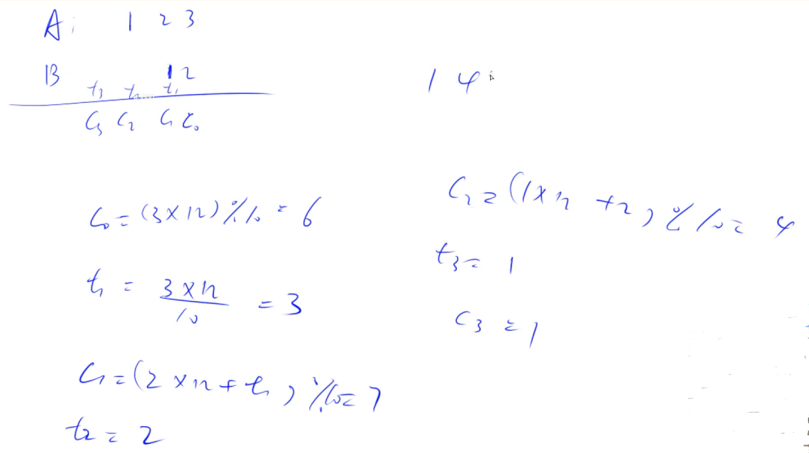 

```cpp
#include "bits/stdc++.h"
using namespace std;

vector<int> mul(vector<int>&A,int b)
{
    vector<int>C;
    int t = 0;
    for(int i = 0;i < A.size() || t;++i)
    {
        if(i < A.size())    t += A[i]*b;
        C.push_back(t % 10);
        t /= 10;
    }
    while(C.size()>1&&C.back()==0)  C.pop_back();   //去除前导0
    return C;
}

int main()
{
    string a;
    int b;
    cin >> a >> b;
    vector<int>A;
    for(int i = a.size()-1;i >= 0;--i)  A.push_back(a[i] -'0');
    auto C = mul(A,b);
    for(int i = C.size()-1;i >= 0;--i)  printf("%d",C[i]);
    return 0;
}
```

**高**精度乘以**高**精度    参考[LeetCode-43](https://leetcode-cn.com/problems/multiply-strings/) 
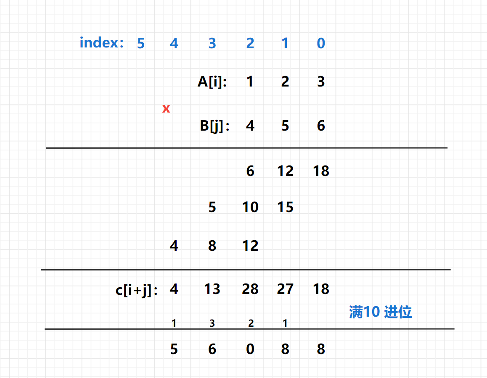 
```cpp
#include<bits/stdc++.h>
using namespace std;
string a,b;

vector<int> mul(vector<int>&A,vector<int>&B)
{
    int len1 = A.size(),len2 = B.size();
    vector<int>C(len1+len2);
    for(int i = 0;i < len1;++i)
    {
        for(int j = 0;j < len2;++j)
        {
            C[i+j] += A[i]*B[j];
        }
    }
    int t = 0;
    for(int i = 0;i < C.size();++i)
    {
        t += C[i];
        C[i] = t % 10;
        t /= 10;
    }
    while(C.size()>1 && C.back() == 0)  C.pop_back();
    return C;
}

int main()
{
    cin >> a >> b;
    vector<int>A,B;
    for(int i = a.size()-1;i >= 0;--i)  A.push_back(a[i]-'0');
    for(int i = b.size()-1;i >= 0;--i)  B.push_back(b[i]- '0');
    auto C = mul(A,B);
    for(int i = C.size()-1;i >= 0;--i)  printf("%d",C[i]);
    return 0;
}
```
#### AcWing 794. 高精度除法

**输入样例**

```
7
2
```

**输出样例**

```
3
1
```

**解析**

区别前者，从**最高位**开始算。也可以不用从后往前存，此处为统一操作都从后向前存。

```cpp
#include "bits/stdc++.h"
using namespace std;

// A/b,商为C,余数是r
vector<int> div(vector<int>&A,int &b,int &r)
{
    vector<int> C;  //商
    r = 0;
    for(int i = A.size()-1;i >= 0;--i)
    {
        r = r*10 + A[i];
        C.push_back(r/b);
        r %= b;
    }
    reverse(C.begin(),C.end());
    while(C.size()>1&&C.back()==0)  C.pop_back();
    return C;
}

int main()
{
    string a;
    int b;
    cin >> a >> b;
    vector<int> A;
    for(int i = a.size()-1;i >= 0;--i)  A.push_back(a[i] - '0');
    int r = 0;
    auto C = div(A,b,r);
    for(int i = C.size()-1;i >=0;--i)   printf("%d",C[i]);
    cout<<endl<<r<<endl;
}
```


### 前缀和与差分

#### AcWing 795. 前缀和

**输入样例**

```
5 3
2 1 3 6 4
1 2
1 3
2 4
```

**输出样例**

```
3
6
10
```

**解析**

做题的时候一般使用 **scanf printf**。
cin 和 cout 比 scanf printf 慢的多。因为cin cout与stdin stdout总是保持同步，这个兼容性的特性，导致 cin 有许多额外开销。
ios::sync_with_stdio(false);这条语句作用是关掉scanf 和cin 的同步，加快效率；劣势是scanf和cin 无法混用。

----------

```cpp
#include<bits/stdc++.h>
using namespace std;

const int N = 100010;
int n,m,q[N],s[N];

int main()
{
    //ios::sync_with_stdio(false);

    scanf("%d%d",&n,&m);
    for (int i = 1; i <= n; i ++ )   scanf("%d",&q[i]);
    
    for(int i = 1;i <= n; i ++ )    s[i] = s[i-1] + q[i];
    
    while (m -- )
    {
        int l,r;
        scanf("%d%d", &l, &r);
        printf("%d\n",s[r]-s[l-1]);
    }
    return 0;
}
```

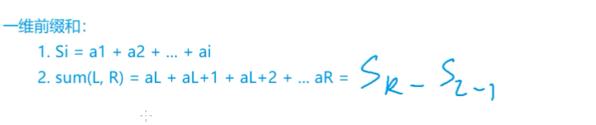 
1.预处理前缀和数组
2.用公式求区间和

有f(i-1)等 -1 的操作一般循环从 **1** 开始。


#### AcWing 796. 子矩阵的和

**输入样例**

```
3 4 3
1 7 2 4
3 6 2 8
2 1 2 3
1 1 2 2
2 1 3 4
1 3 3 4
```

**输出样例**

```
17
27
21
```

**解析**

下标从 **1** 开始
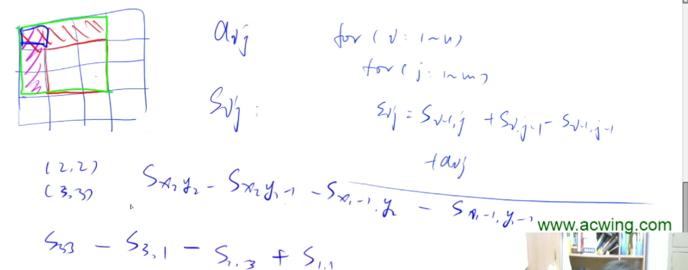 

```cpp
#include<bits/stdc++.h>
using namespace std;
int n,m,q;
const int N = 1010;
int a[N][N],s[N][N];
int main()
{
    scanf("%d%d%d", &n, &m,&q);
    for(int i = 1;i <= n;++i)
    {
        for(int j = 1;j <= m;++j)
        {
            scanf("%d", &a[i][j]);
        }
    }
    for(int i = 1;i <= n;++i)
    {
        for(int j = 1;j <= m;++j)
        {
            s[i][j] = s[i-1][j]+s[i][j-1]-s[i-1][j-1]+a[i][j];  //求前缀和
        }
    }
    while (q -- )
    {
        int x1,y1,x2,y2;
        scanf("%d%d%d%d",&x1,&y1,&x2,&y2);
        printf("%d\n",s[x2][y2]-s[x2][y1-1]-s[x1-1][y2]+s[x1-1][y1-1]); //算子矩阵
    }
    return 0;
}
```

(习题课)
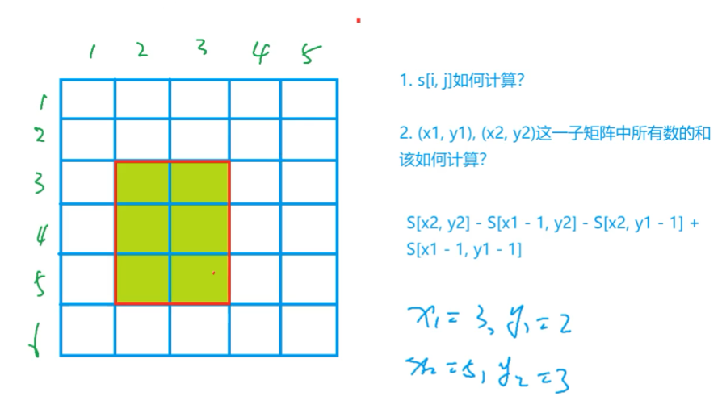 
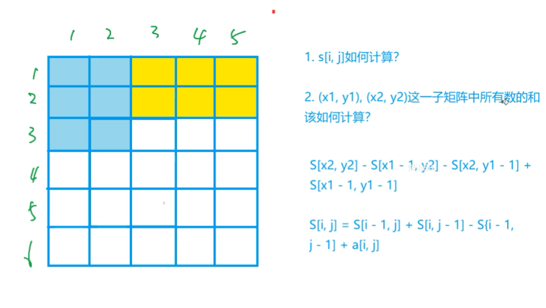

#### AcWing 797. 差分

输入一个长度为 n 的整数序列。

接下来输入 m 个操作，每个操作包含三个整数 l,r,c，表示将序列中 [l,r] 之间的每个数加上 c。

**输入样例**

```
6 3
1 2 2 1 2 1
1 3 1
3 5 1
1 6 1
```

**输出样例**

```
3 4 5 3 4 2
```

**解析**

差分无需专门考虑**构造**问题，考虑如何 **更新** 即可。构造与修改操作可统一

```cpp
#include<bits/stdc++.h>
using namespace std;
const int N = 100010;
int n,m;
int a[N],b[N];

void insert(int l,int r,int c)
{
    b[l] += c;
    b[r+1] -= c;
}

int main()
{
    scanf("%d%d", &n, &m);
    for(int i = 1;i <= n;++i)   scanf("%d",&a[i]);  
    
    for(int i = 1;i <= n;++i)   insert(i,i,a[i]);   //构造b[i]矩阵(差分)
    
    while (m -- )
    {
        int l,r,c;
        scanf("%d%d%d", &l, &r,&c);
        insert(l,r,c);
    }
    
    for(int i = 1;i <= n;++i)   b[i] += b[i-1];     //前缀和计算(原数组) 或 a[i] = a[i-1] + b[i]
    
    for(int i = 1;i <= n;++i)   printf("%d ",b[i]); //接上 或 a[i]
    
    return 0;
}
```

(习题课)
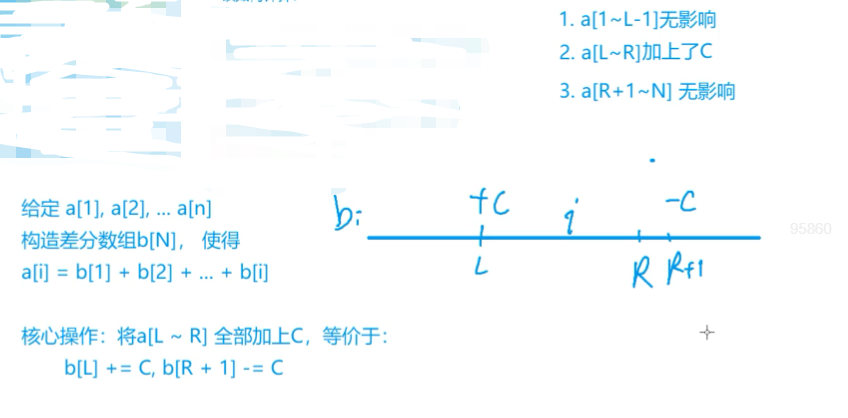 
构造同 [1,1] a1     [2,2] a2 …

#### AcWing 798. 差分矩阵

输入一个 n 行 m 列的整数矩阵，再输入 q 个操作，每个操作包含五个整数 x1,y1,x2,y2,c，其中 (x1,y1) 和 (x2,y2) 表示一个子矩阵的左上角坐标和右下角坐标。

每个操作都要将选中的子矩阵中的每个元素的值加上 c。

**输入样例**

```
3 4 3
1 2 2 1
3 2 2 1
1 1 1 1
1 1 2 2 1
1 3 2 3 2
3 1 3 4 1
```

**输出样例**

```
2 3 4 1
4 3 4 1
2 2 2 2
```

**解析**

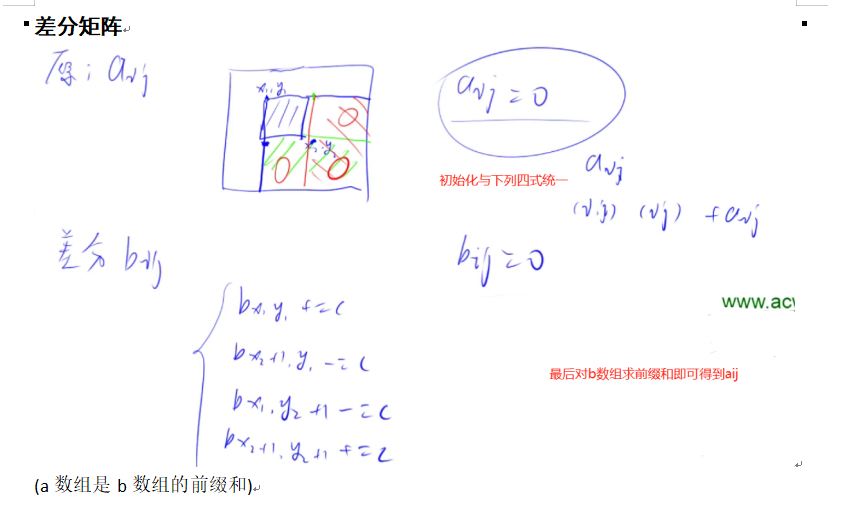 

```cpp
#include<bits/stdc++.h>
using namespace std;
const int N = 1010;
int n,m,q;
int a[N][N],b[N][N];

void insert(int x1,int y1,int x2,int y2,int c)
{
    b[x1][y1] += c;
    b[x2+1][y1] -= c;
    b[x1][y2+1] -= c;
    b[x2+1][y2+1] += c;
}

int main()
{
    scanf("%d%d%d",&n,&m,&q);
    for(int i = 1;i <= n;++i)
        for(int j = 1;j <= m;++j)
            scanf("%d",&a[i][j]);
    for(int i = 1;i <= n;++i)
        for(int j = 1;j <= m;++j)
            insert(i,j,i,j,a[i][j]);
    
    while(q -- )
    {
        int x1,y1,x2,y2,c;
        scanf("%d%d%d%d%d",&x1,&y1,&x2,&y2,&c);
        insert(x1,y1,x2,y2,c);
    }
    
    for(int i = 1;i <= n;++i)
    {
        for(int j = 1;j <= m;++j)
        {
            b[i][j] += b[i-1][j] + b[i][j-1] - b[i-1][j-1];
        }
    }
    
    for(int i = 1;i <= n;++i)
    {
        for(int j = 1;j <= m;++j)
        {
            printf("%d ",b[i][j]);
        }
        puts("");
    }
    return 0;
}
```

(习题课)
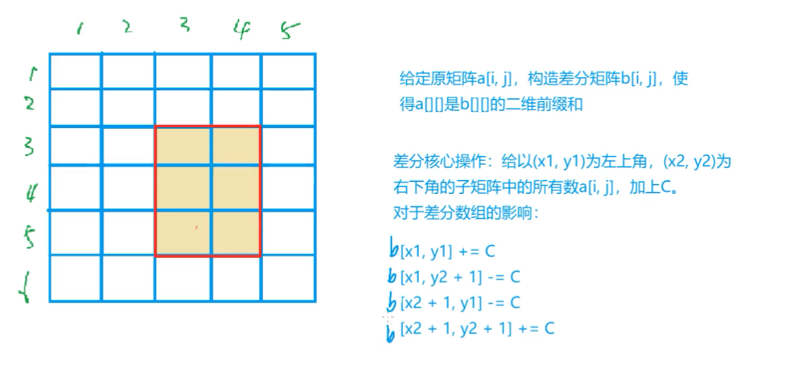


### 双指针算法

#### AcWing 799. 最长连续不重复子序列

给定一个长度为 n 的整数序列，请找出最长的不包含重复的数的连续区间，输出它的长度。

**输入样例**

```
5
1 2 2 3 5
```

**输出样例**

```
3
```

**解析**

1 2 2 3 5
——i
j
**s[a[j]]--**;  //除去1
**j++;  **      //j右移

```cpp
#include<bits/stdc++.h>
using namespace std;

const int N = 100010;
int n,a[N],s[N];

int main()
{
    scanf("%d", &n);
    for(int i = 0;i < n;++i)    scanf("%d",&a[i]);
    int res = 0;
    for(int i = 0,j = 0;i < n;++i)
    {
        s[a[i]] ++;
        while(j < i && s[a[i]] > 1) //注意是 s[a[i]] > 1      i
        {
            s[a[j]] -- ;            //注意是 s[a[j]]--        j
            j ++;
        }
        res = max(res,i-j+1);
    }
    cout<<res<<endl;
    return 0;
}

```
#### AcWing 800. 数组元素的目标和

给定两个升序排序的有序数组 A 和 B，以及一个目标值 x。数组下标从 0 开始。求出满足 A[i]+B[j]=x 的数对 (i,j)。数据保证有唯一解。

**输入样例**

```
4 5 6
1 2 4 7
3 4 6 8 9
```

**输出样例**

```
1 1
```

**解析**

```cpp
#include<bits/stdc++.h>
using namespace std;
const int N = 100010;
int a[N],b[N];
int n,m,x;
int main()
{
    cin >> n >> m >> x;
    for (int i = 0; i < n; i ++ )   scanf("%d",&a[i]);
    for (int i = 0; i < m; i ++ )   scanf("%d",&b[i]);
    
    for(int i = 0,j = m-1;i < n;++i)
    {
        while(j >= 0 && a[i]+b[j] > x)  j--;
        if(j >= 0 && a[i] + b[j] == x)  cout << i << ' ' << j << endl;
    }
    return 0;
}
```

----------


双指针时间复杂度 **O(n+m)**。
如果题有多个答案，不能用双指针，复杂度为O(nm)。

#### AcWing 2816. 判断子序列

给定一个长度为 n 的整数序列 a1,a2,…,an 以及一个长度为 m 的整数序列 b1,b2,…,bm。判断 a 序列是否为 b 序列的子序列。子序列指序列的一部分项按原有次序排列而得的序列，例如序列 {a1,a3,a5} 是序列 {a1,a2,a3,a4,a5} 的一个子序列。

**输入样例**

```
3 5
1 3 5
1 2 3 4 5
```

**输出样例**

```
Yes
```

**解析**

```cpp
#include<bits/stdc++.h>
using namespace std;
const int N = 100010;
int a[N],b[N];
int n,m;
int main()
{
    cin >> n >> m;
    
    for (int i = 0; i < n; i ++ )   scanf("%d",&a[i]);
    for (int i = 0; i < m; i ++ )   scanf("%d",&b[i]);
    
    int i = 0,j = 0;
    while(i < n && j < m)
    {
        if(a[i] == b[j])    i++;
        j++;
    }
    if(i == n)  puts("Yes");
    else    puts("No");
    return 0;
}
```


### 位运算

#### AcWing 801. 二进制中1的个数

给定一个长度为 n 的数列，请你求出数列中每个数的二进制表示中 1 的个数。

**输入样例**

```
5
1 2 3 4 5
```

**输出样例**

```
1 1 2 1 2
```

**解析**

1.求 n 第 k 位数字：**n>>k&1**
2.返回 n 最后一位1：**lowbit(n) = n & -n**

```cpp
#include<bits/stdc++.h>
using namespace std;

int lowbit(int &x)
{
    return x&(-x);
}

int main()
{
    int n;
    cin >> n;
    while (n -- )
    {
        int x;
        cin >> x;
        int res = 0;
        while(x)    x -= lowbit(x),res++;
        cout << res << ' ';
    }
    return 0;
}
```
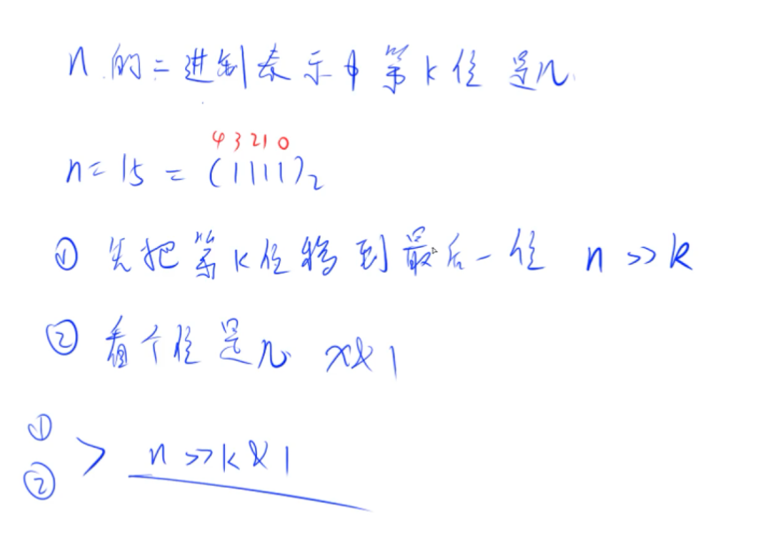 

> 10
> for(int k = 3;k >= 0;k--) cout << (n>>k&1)<<endl;
> 1010

**lowbit(x)**
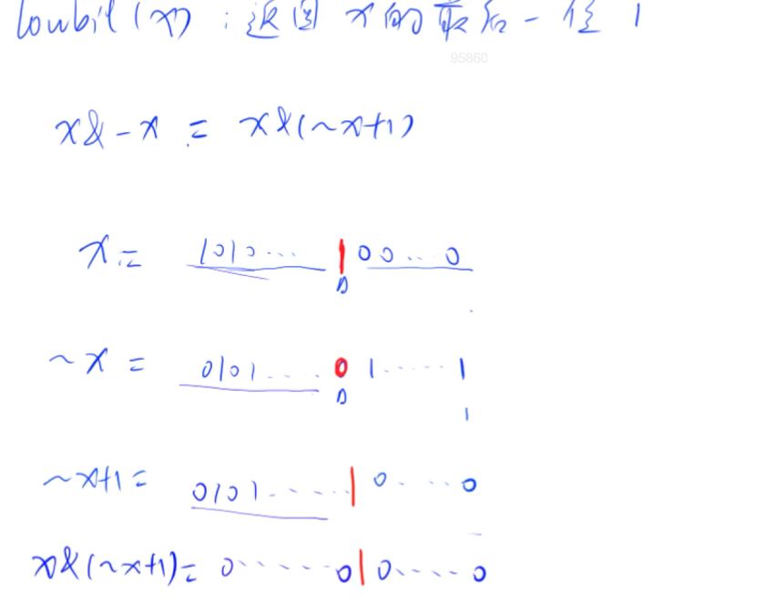  

> 0000 0011=3，它的相反数为-3=1000 0011，但0000 0011 + 1000 0011 != 0000 0000。计算机就引入了**补码**，相当于上面的相反数的表示。将人容易理解的二进制称为**原码**，计算机实际使用时用的是补码。**正数的补码就是自己，负数的补码为按位取反加1**。
> 对于1000 0011来说，若其为原码，则表示-3；若其为补码，则表示(-1)*2^7 + 1*2^1 + 1*2^0 = -125。
> 应用：求x里面1的个数。


### 离散化

#### AcWing 802. 区间和

假定有一个无限长的数轴，数轴上每个坐标上的数都是 0。现在，我们首先进行 n 次操作，每次操作将某一位置 x 上的数加 c。接下来，进行 m 次询问，每个询问包含两个整数 l 和 r，你需要求出在区间 [l,r] 之间的所有数的和。

**输入样例**

```
3 3
1 2
3 6
7 5
1 3
4 6
7 8
```

**输出样例**

```
8
0
5
```

**解析**

总共 2×10^9 个数，但最多只使用 **3×10^5**。故开三十万：
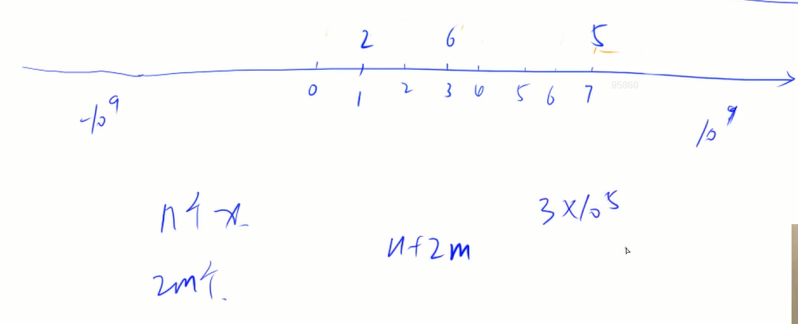 
基本做法：
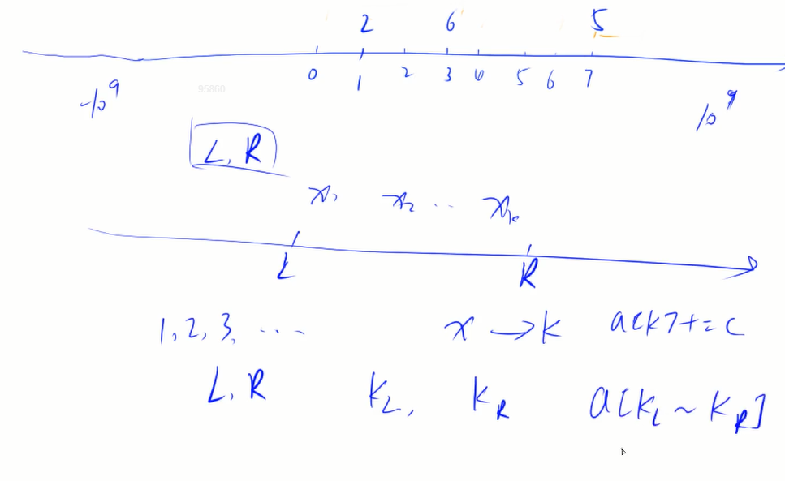 

```cpp
#include<bits/stdc++.h>
using namespace std;
const int N = 300010;
int n,m;
int a[N],s[N];  //a[N]为存的数。s[N]为前缀和
vector<int>alls;    //存的所有要离散化的值

typedef pair<int, int> PII;
vector<PII> add,query;  //插入操作。求操作


int find(int x) //用于求 x 离散化的结果
{
    int l = 0,r = alls.size()-1;
    while(l < r)
    {
        int mid = l+r>>1;
        if(alls[mid] >= x)  r = mid;    //>=x最小的数
        else    l = mid+1;
    }
    return r+1; //映射的数值为从1开始的自然数。方便前缀和运算 
    //若不想写二分，可以写lower_board
    //return lower_board(alls.begin(),alls.end(),x) - alls.begin() + 1;
}

int main()
{
    cin >> n >> m;
    //先把所有要操作的数先读进来，将其中用到的下标离散化
    for (int i = 0; i < n; i ++ )
    {
        int x,c;
        cin >> x >> c;
        add.push_back({x,c});
        
        alls.push_back(x);
    }
    //读入所有的左右区间
    for(int i = 0;i < m;++i)
    {
        int l,r;
        cin >> l >> r; 
        query.push_back({l,r});
        //区间两个端点都应该离散化
        alls.push_back(l);
        alls.push_back(r);
    }
    //至此，所有需要用到下标皆已存。下一步 去重
    sort(alls.begin(),alls.end());
    alls.erase(unique(alls.begin(),alls.end()),alls.end());
    
    //处理插入
    for(auto item:add)
    {
        int x = find(item.first);
        a[x] += item.second;    //在离散化后的坐标位置上加上要加的数
    }
    
    //预处理前缀和
    for (int i = 1; i <= alls.size(); i ++ )
    {
        s[i] = s[i-1]+a[i];
    }
    
    //处理询问
    for(auto item:query)
    {
        int l = find(item.first),r = find(item.second);
        cout << s[r] - s[l-1] << endl;
    }
    
    return 0;
}
```


unique的实现：
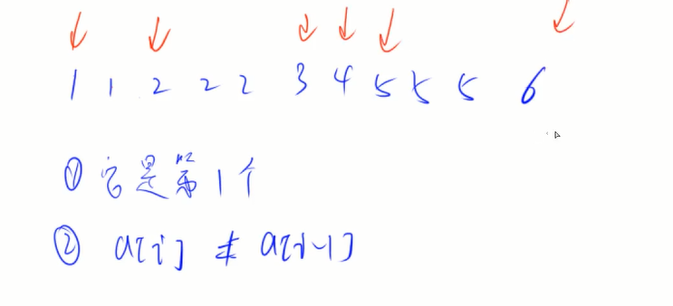 
双指针
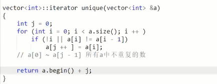


### 区间合并

#### AcWing 803. 区间合并

给定 n 个区间 [li,ri]，要求合并所有有交集的区间。注意如果在端点处相交，也算有交集。输出合并完成后的区间个数。例如：[1,3] 和 [2,6] 可以合并为一个区间 [1,6]。

**输入样例**

```
5
1 2
2 4
5 6
7 8
7 9
```

**输出样例**

```
3
```

**解析**

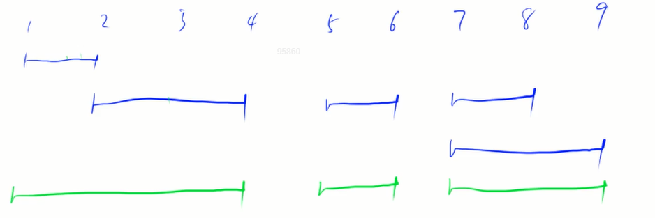 
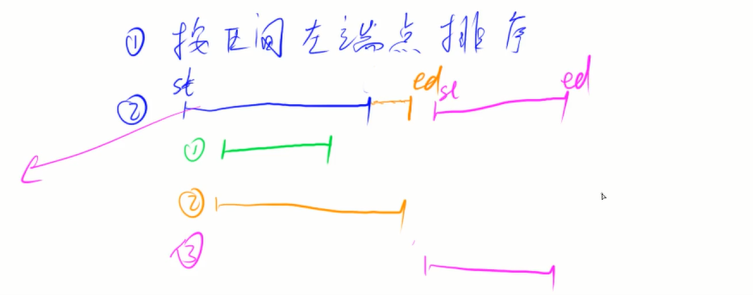 
pair在sort时优先左端点排序，再右端点排序

```cpp
#include<bits/stdc++.h>
using namespace std;
typedef pair<int, int> PII;

vector<PII>segs;

void merge(vector<PII>&segs)
{
    vector<PII>res;
    sort(segs.begin(),segs.end());
    int st = -2e9,ed = -2e9;            //起始维护值
    for(auto seg:segs)
    {
        if(ed < seg.first)
        {
            if(st!=-2e9)    res.push_back({st,ed});
            st = seg.first, ed = seg.second;
        }
        else    ed = max(ed,seg.second);
    }
    if(st!=-2e9)    res.push_back({st,ed});     //加上最后一次
    segs = res;
}

int main()
{
    int n;
    cin >> n;
    for (int i = 0; i < n; i ++ )
    {
        int l,r;
        cin >> l >> r;
        segs.push_back({l,r});
    }
    merge(segs);
    cout << segs.size() <<endl;
}
```


chapter 1 END。