# lecture 2 数据结构

## 模板

### 单链表

**数组模拟** 比 **动态分配**链表【struct Node {}; new Node();】 快	

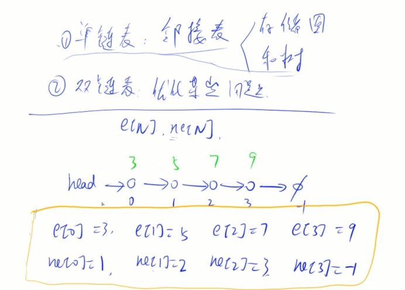 

```cpp
// head存储链表头，e[]存储节点的值，ne[]存储节点的next指针，idx表示当前用到了哪个节点
int head, e[N], ne[N], idx;

// 初始化
void init()
{
    head = -1;
    idx = 0;
}

// 在链表头插入一个数a
void insert(int a)
{
    e[idx] = a, ne[idx] = head, head = idx ++ ;
}

// 将头结点删除，需要保证头结点存在
void remove()
{
    head = ne[head];
}
```


### 双链表

```cpp
// e[]表示节点的值，l[]表示节点的左指针，r[]表示节点的右指针，idx表示当前用到了哪个节点
int e[N], l[N], r[N], idx;

// 初始化
void init()
{
    //0是左端点，1是右端点
    r[0] = 1, l[1] = 0;
    idx = 2;
}

// 在节点a的右边插入一个数x
void insert(int a, int x)
{
    e[idx] = x;
    l[idx] = a, r[idx] = r[a];
    l[r[a]] = idx, r[a] = idx ++ ;
}

// 删除节点a
void remove(int a)
{
    l[r[a]] = l[a];
    r[l[a]] = r[a];
}
```


### 栈

```cpp
// tt表示栈顶
int stk[N], tt = 0;

// 向栈顶插入一个数
stk[ ++ tt] = x;

// 从栈顶弹出一个数
tt -- ;

// 栈顶的值
stk[tt];

// 判断栈是否为空
if (tt > 0)
{
    
}
```


### 队列

```cpp
// hh 表示队头，tt表示队尾
int q[N], hh = 0, tt = -1;

// 向队尾插入一个数
q[ ++ tt] = x;

// 从队头弹出一个数
hh ++ ;

// 队头的值
q[hh];

// 判断队列是否为空
if (hh <= tt)
{
    
}
```


### 单调栈

常见模型：找出每个数左边离它最近的比它大/小的数

```cpp
int tt = 0;
for (int i = 1; i <= n; i ++ )
{
	while (tt && check(q[tt], i)) tt -- ;
	stk[ ++ tt] = i;
}
```


### 单调队列

常见模型：找出滑动窗口中的最大值/最小值

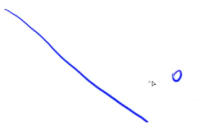 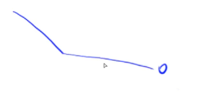

删除，直到它严格单调。

```cpp
int hh = 0, tt = -1;
for (int i = 0; i < n; i ++ )
{
	while (hh <= tt && check_out(q[hh])) hh ++ ;  // 判断队头是否滑出窗口
	while (hh <= tt && check(q[tt], i)) tt -- ;
	q[ ++ tt] = i;
}
```


### KMP

```cpp
求Next数组：
// s[]是模式串，p[]是模板串, n是s的长度，m是p的长度
for (int i = 2, j = 0; i <= m; i ++ )
{
	while (j && p[i] != p[j + 1]) j = ne[j];
	if (p[i] == p[j + 1]) j ++ ;
	ne[i] = j;
}

// 匹配
for (int i = 1, j = 0; i <= n; i ++ )
{
	while (j && s[i] != p[j + 1]) j = ne[j];
	if (s[i] == p[j + 1]) j ++ ;
	if (j == m)
	{
		j = ne[j];
		// 匹配成功后的逻辑
	}
}
```


### Trie树

高效地存储和查找字符串集合的数据结构。

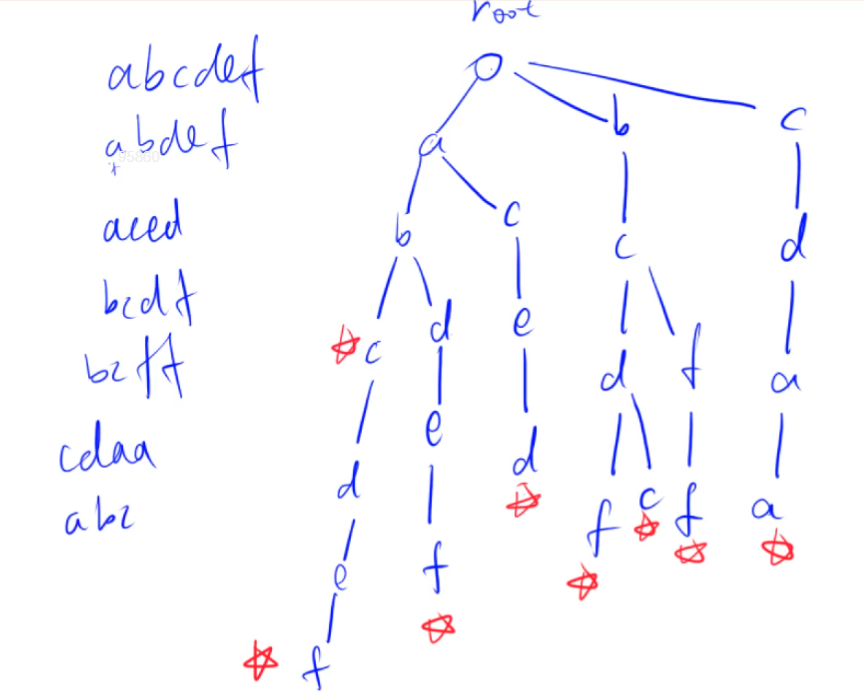

```cpp
int son[N][26], cnt[N], idx;
// 0号点既是根节点，又是空节点
// son[][]存储树中每个节点的子节点
// cnt[]存储以每个节点结尾的单词数量
// idx 作用同单链表。 存的是我们当前用到了哪个节点

// 插入一个字符串
void insert(char *str)
{
	int p = 0;
	for (int i = 0; str[i]; i ++ )
	{
		int u = str[i] - 'a';
		if (!son[p][u]) son[p][u] = ++ idx;
		p = son[p][u];
	}
	cnt[p] ++ ;
}

// 查询字符串出现的次数
int query(char *str)
{
	int p = 0;
	for (int i = 0; str[i]; i ++ )
	{
		int u = str[i] - 'a';
		if (!son[p][u]) return 0;
		p = son[p][u];
	}
	return cnt[p];
}
```


### 并查集

1. 将两个集合合并；
2. 询问两个元素是否在一个集合当中。

> 普通暴力的做法：
>
>   belong[x] = a  集合编号 
>
>   if(belong[x] == belong[y])   
>
> 查询是否一个集合易 O(1) ，合并则比较复杂 O(n) 。
>
> 并查集可近似 O(1) 完成上述两个操作。

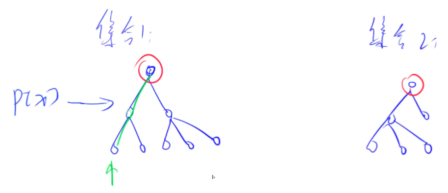

**基本原理**

每个集合用一棵树来表示。树根节点的编号就是当前集合的编号。每个节点存储它的父节点，p[x] 表示 x 的父节点。

- 问题1：如何判断树根

  if(p[x] == x)

- 问题2：如何求 x 的集合编号

  while(p[x] != x) x = p[x];

- 问题3：如何合并两个集合

  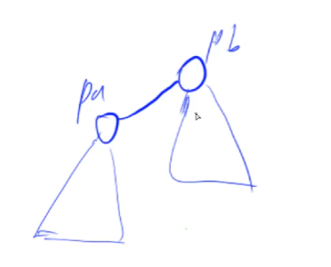 

  px 是 x 的集合编号，py 是 y 的集合编号。p[x] = y。


> 问题 2 的时间复杂度较高，可进行 **路径压缩**(如图) 或 按值合并(让高度小的树接到高度大的树) 优化。
>
> 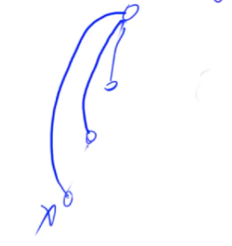


#### 朴素并查集

```c++
int p[N]; //存储每个点的祖宗节点

// 返回x的祖宗节点
int find(int x)
{
    if (p[x] != x) p[x] = find(p[x]);
    return p[x];
}

// 初始化，假定节点编号是1~n
for (int i = 1; i <= n; i ++ ) p[i] = i;

// 合并a和b所在的两个集合：
p[find(a)] = find(b);
```

#### 维护size的并查集


```c++
int p[N], size[N];
//p[]存储每个点的祖宗节点, size[]只有祖宗节点的有意义，表示祖宗节点所在集合中的点的数量

// 返回x的祖宗节点
int find(int x)
{
    if (p[x] != x) p[x] = find(p[x]);
    return p[x];
}

// 初始化，假定节点编号是1~n
for (int i = 1; i <= n; i ++ )
{
    p[i] = i;
    size[i] = 1;
}

// 合并a和b所在的两个集合：
p[find(a)] = find(b);
size[b] += size[a];
```

#### 维护到祖宗节点距离的并查集

```cpp
int p[N], d[N];
//p[]存储每个点的祖宗节点, d[x]存储x到p[x]的距离

// 返回x的祖宗节点
int find(int x)
{
if (p[x] != x)
{
    int u = find(p[x]);
    d[x] += d[p[x]];
    p[x] = u;
}
    return p[x];
}

// 初始化，假定节点编号是1~n
for (int i = 1; i <= n; i ++ )
{
    p[i] = i;
    d[I] = 0;
}

// 合并a和b所在的两个集合：
p[find(a)] = find(b);
d[find(a)] = distance; // 根据具体问题，初始化find(a)的偏移量
```


### 堆

手写堆，STL中形式是优先队列。

**形式**

完全二叉树；小根堆(根节点 <= 左右子节点)；大根堆

**存储**

一维数组

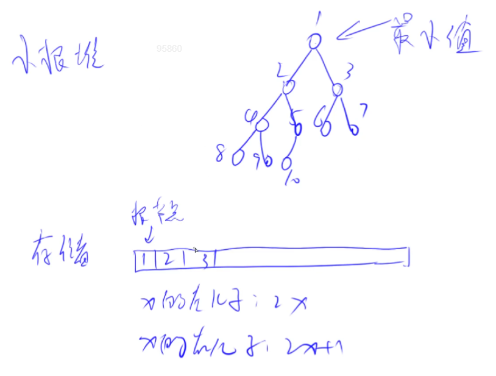

**操作**

- down(x) {}  往下调   [O(logn)]

  使用场景：某一个值变大了，需要下移。

  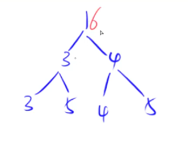 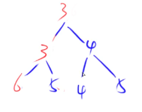 

- up(x) {}  往上调

  使用场景：某一个值变小了，需要上移。

1. 插入一个数 &emsp;`heap[++size] = x;&emsp;up(size);`
2. 求集合当中的最小值[O(1)]&emsp;`heap[1];`
3. 删除最小值&emsp;`heap[1] = heap[size]; size--; down(1);`
4. *删除任意一个元素&emsp;`heap[k] = heap[size]; size--; down(k); up(k);`
5. *修改任意一个元素&emsp;`heap[k] = x; down(k); up(k);` 

**建堆**

有两种建堆的方法:

1. 一种是从一个空树开始，每次输入一个数，就按照插入操作插入这个树，时间复杂度 **nlogn** (一共n个元素，每个元素logn)。
2. 还有一种建堆方法是已经把数据都输入到了数组 a[N] ，怎么根据这个数组直接建堆。就是从 n/2 开始down()，因为 n/2 是倒数第二层，如果是倒数第一层其实每个节点自然成堆了，所以从倒数第二层开始，是最简单的一个二层树结构，down 完形成一个堆。从右下角往左边开始建堆，这样从下往上之后，轮到每个节点他下面的子树肯定已经成堆了，满足 down 的条件。

复杂度分析：(以完全二叉树为例)

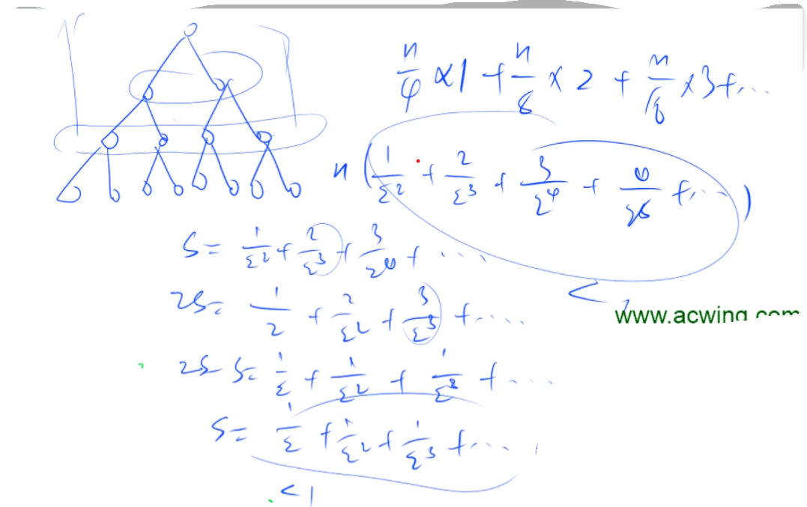

为什么是 n/4 * 1 + n/8 * 2 +… ？

根据每一层的节点树乘以需要往下down的迭代次数（其实就是往下的层树）。假设一共有n个元素的完全二叉树，那么最后一层有n/2个元素(满二叉树情况)，不需要往下down()， 倒数第二层(含)之上总共n/2个节点。i = n / 2是最后一个拥有孩子的节点，n/2以下的节点一定是一个子节点，就从非子节点开始向上建立堆。

倒数第二层有n/4个元素，每个元素最多往下down一次，倒数第三层有n/8个元素，每个元素最多往下down两次……以此类推。最终是一个等差等比混合数列的求和，为**O(n)**的复杂度。

```c++
// h[N]存储堆中的值, h[1]是堆顶，x的左儿子是2x, 右儿子是2x + 1
// ph[k]存储第k个插入的点在堆中的位置
// hp[k]存储堆中下标是k的点是第几个插入的
int h[N], ph[N], hp[N], size;
// 交换两个点，及其映射关系
void heap_swap(int a, int b)
{
	swap(ph[hp[a]],ph[hp[b]]);
	swap(hp[a], hp[b]);
	swap(h[a], h[b]);
}
void down(int u)
{
	int t = u;
	if (u * 2 <= size && h[u * 2] < h[t]) t = u * 2;
	if (u * 2 + 1 <= size && h[u * 2 + 1] < h[t]) t = u * 2 + 1;
	if (u != t)
	{
		heap_swap(u, t);
		down(t);
	}
}

void up(int u)
{
	while (u / 2 && h[u] < h[u / 2])
	{
		heap_swap(u, u / 2);
		u >>= 1;
	}
}

// O(n)建堆
for (int i = n / 2; i; i -- ) down(i);
```


### 哈希表

#### 一般哈希(存储结构)

x ∈ (-10^9^,10^9^)，h(x) ∈ (0,10^5^)

1. x mod 10^5^  ∈  [0,10^5^]
2. 冲突问题。

方法

1. 拉链法

    ```c++
    int h[N], e[N], ne[N], idx;

    // 向哈希表中插入一个数

    void insert(int x)
    {
        int k = (x % N + N) % N;
        e[idx] = x;
        ne[idx] = h[k];
        h[k] = idx ++ ;
    }

    // 在哈希表中查询某个数是否存在
    bool find(int x)
    {
        int k = (x % N + N) % N;
        for (int i = h[k]; i != -1; i = ne[i])
            if (e[i] == x)
                return true;

        return false;
    }
    ```

2. 开放寻址法

    ```c++
    int h[N];
    // 如果x在哈希表中，返回x的下标；如果x不在哈希表中，返回x应该插入的位置
    int find(int x)
    {
        int t = (x % N + N) % N;
        while (h[t] != null && h[t] != x)
        {
            t ++ ;
            if (t == N) t = 0;
        }
        return t;
    }
    ```


#### 字符串哈希

核心思想：将字符串看成P进制数，P的经验值是131或13331，取这两个值的冲突概率低

小技巧：取模的数用2^64，这样直接用unsigned long long存储，溢出的结果就是取模的结果

```c++
typedef unsigned long long ULL;
ULL h[N], p[N]; // h[k]存储字符串前k个字母的哈希值, p[k]存储 P^k mod 2^64
// 初始化
p[0] = 1;
for (int i = 1; i <= n; i ++ )
{
    h[i] = h[i - 1] * P + str[i];
    p[i] = p[i - 1] * P;
}
// 计算子串 str[l ~ r] 的哈希值
ULL get(int l, int r)
{
	return h[r] - h[l - 1] * p[r - l + 1];
}
```


### STL简介

#### vector

变长数组，倍增思想

1. size()  返回元素个数
2. empty()  返回是否为空
3. clear()  清空
4. front()/back()
5. push_back()/pop_back()
6. begin()/end()
7. []
8. 支持比较运算，按字典序

#### pair<int, int>

1. first, 第一个元素
2. second, 第二个元素
3. 支持比较运算，以first为第一关键字，以second为第二关键字（字典序）

#### string

字符串

1. szie()/length()  返回字符串长度
2. empty()
3. clear()
4. substr(起始下标，(子串长度))  返回子串
5. c_str()  返回字符串所在字符数组的起始地址

#### queue

队列

1. size()
2. empty()
3. push()  向队尾插入一个元素
4. front()  返回队头元素
5. back()  返回队尾元素
6. pop()  弹出队头元素

#### priority_queue

优先队列，默认是大根堆

1. push()  插入一个元素
2. top()  返回堆顶元素
3. pop()  弹出堆顶元素
4. 定义成小根堆的方式：priority_queue<int, vector<int>, greater<int>> q;

#### stack

栈

1. size()
2. empty()
3. push()  向栈顶插入一个元素
4. top()  返回栈顶元素
5. pop()  弹出栈顶元素

#### deque

双端队列

1. size()
2. empty()
3. clear()
4. front()/back()
5. push_back()/pop_back()
6. push_front()/pop_front()
7. begin()/end()
8. []

#### set, map, multiset, multimap

基于平衡二叉树（红黑树），动态维护有序序列

- size()
- empty()
- clear()
- begin()/end()
- ++, -- 返回前驱和后继，时间复杂度 O(logn)

1. set/multiset

   insert()  插入一个数
   find()  查找一个数
   count()  返回某一个数的个数
   erase()

   1. 输入是一个数x，删除所有x   O(k + logn)
   2. 输入一个迭代器，删除这个迭代器

   lower_bound()/upper_bound()

   1. lower_bound(x)  返回大于等于x的最小的数的迭代器
   2. upper_bound(x)  返回大于x的最小的数的迭代器

2. map/multimap

   1. insert()  插入的数是一个pair
   2. erase()  输入的参数是pair或者迭代器
   3. find()
   4. []   时间复杂度是 O(logn)
   5. lower_bound()/upper_bound()

#### unordered_set, unordered_map, unordered_multiset, unordered_multimap

哈希表

和上面类似，增删改查的时间复杂度是 O(1)。

不支持 lower_bound()/upper_bound()， 迭代器的++，--

#### bitset

圧位

```c++
bitset<10000> s;
~, &, |, ^
>>, <<
==, !=
[]
count()  返回有多少个1
any()  判断是否至少有一个1
none()  判断是否全为0
set()  把所有位置成1
set(k, v)  将第k位变成v
reset()  把所有位变成0
flip()  等价于~
flip(k) 把第k位取反
```


## 题目

### 单链表

#### AcWing 826. [单链表](https://www.acwing.com/problem/content/828/)

实现一个单链表，链表初始为空，支持三种操作：

1. 向链表头插入一个数；

2. 删除第 k 个插入的数后面的数；
3. 在第 k 个插入的数后插入一个数。

现在要对该链表进行 M 次操作，进行完所有操作后，从头到尾输出整个链表。

**注意**:题目中第 k 个插入的数并不是指当前链表的第 k 个数。例如操作过程中一共插入了 n 个数，则按照插入的时间顺序，这 n 个数依次为：第 1 个插入的数，第 2 个插入的数，…第 n 个插入的数。

**输入样例**

```
10
H 9
I 1 1
D 1
D 0
H 6
I 3 6
I 4 5
I 4 5
I 3 4
D 6
```

**输出样例**

```
6 4 6 5
```

**解析**

```c++
#include<bits/stdc++.h>
using namespace std;
const int N = 100010;

// head 表示头结点的下标
// e[i] 表示节点i的值
// ne[i] 表示节点i的next指针是多少
// idx 存储当前已经用到了哪个点
int head,e[N],ne[N],idx;
//初始化
void init()
{
    head = -1;
    idx = 0;
}

//将x插到头结点
void add_to_head(int x)
{
    e[idx] = x, ne[idx] = head, head = idx ++;
}

//将x插到下标为k点后面
void add(int x,int k)
{
    e[idx] = x, ne[idx] = ne[k], ne[k] = idx ++;
}

//将下标是k点的后一个点删除
void remove(int k)
{
    ne[k] = ne[ne[k]];    
}

int main()
{
    int m;
    cin >> m;

    init();

    while (m -- )
    {
        int k,x;
        char op;
        cin >> op;
        if(op == 'H')
        {
            cin >> x;
            add_to_head(x);
        }
        else if(op == 'D')
        {
            cin >> k;            
            if(!k)  head = ne[head];        //k为0的情况,删除头结点
            remove(k-1);        //第k个插入数字 下标对应k-1	//如果初始化head = 0,idx = 1,则不用k-1
        }
        else
        {
            cin >> k >> x;
            add(x,k-1);
        }
    }
    for(int i = head;i != -1;i = ne[i]) cout << e[i] << ' ';        //当前值：e[i]
    return 0;
}
```


### 双链表

#### AcWing 827. [双链表](https://www.acwing.com/problem/content/829/)

**输入格式**

第一行包含整数 M，表示操作次数。

接下来 M 行，每行包含一个操作命令，操作命令可能为以下几种：

1. `L x`，表示在链表的最左端插入数 x。
2. `R x`，表示在链表的最右端插入数 x。
3. `D k`，表示将第 k 个插入的数删除。
4. `IL k x`，表示在第 k 个插入的数左侧插入一个数。
5. `IR k x`，表示在第 k 个插入的数右侧插入一个数。

**输出格式**

共一行，将整个链表从左到右输出。

**解析**

实际为**两个**操作。add,remove [ add(k,x),add(left,x),add(right,x) ]

```cpp
#include<bits/stdc++.h>
using namespace std;
const int N = 100010;
int e[N],r[N],l[N],idx;

void init()
{
    r[0] = 1,l[1] = 0,idx = 2;      //下标的模拟习惯为0与1做首末
}

void add(int k,int x)   //节点k右边插入一个数   注意先后顺序
{
    e[idx] = x;
    l[idx] = k,r[idx] = r[k];
    l[r[k]] = idx,r[k] = idx;
    idx++;
}

void remove(int k)      //删除节点k
{
    l[r[k]] = l[k];
    r[l[k]] = r[k];
}

int main()
{
    int m;
    scanf("%d", &m);
    init();
    while (m -- )
    {
        string s;
        cin >> s;
        int k,x;
        if(s == "L")
        {
            cin >> x;
            add(0,x);
        }
        else if(s == "R")
        {
            cin >> x;
            add(l[1],x);
        }
        else if(s == "D")
        {
            cin >> k;
            remove(k+1);
        }
        else if(s == "IL")
        {
            cin >> k >> x;
            add(l[k+1],x);
        }
        else if(s == "IR")
        {
            cin >> k >> x;
            add(k+1,x);		//第 k 个插入的数, 对应 k+1 下标
        }
    }
    for(int i = r[0];i != 1;i = r[i])   printf("%d ",e[i]);     //其实点为原首节点右一位，末节点为原末节点左一位
}
```


### 栈

#### AcWing 828. [模拟栈](https://www.acwing.com/problem/content/830/)

实现一个栈，栈初始为空，支持四种操作：

1. push x – 向栈顶插入一个数 x；
2. pop – 从栈顶弹出一个数；
3. empty – 判断栈是否为空；
4. query – 查询栈顶元素。

**输入样例**

```
10
push 5
query
push 6
pop
query
pop
empty
push 4
query
empty
```

**输出样例**

```
5
5
YES
4
NO
```

**解析**

```c++
#include<bits/stdc++.h>
using namespace std;
const int N = 100010;
int stk[N],tt;

void push(int x)
{
    stk[++tt] = x;
}
void pop()
{
    tt--;
}
void empty()
{
    if(tt == 0) cout << "YES" << endl;
    else    cout << "NO" << endl;
}
void query()
{
    cout << stk[tt] << endl;            //插入时为 stk[++tt] = x ，直接输出 stk[tt];
}
int main()
{
    int m;
    cin >> m;
    while (m -- )
    {
        string op;
        cin >> op;
        int x;
        if(op == "push")
        {
            cin >> x;
            push(x);
        }
        else if(op == "pop")
        {
            pop();
        }
        else if(op == "empty")
        {
            empty();
        }
        else if(op == "query")
        {
            query();
        }
    }
    return 0;
}
```


#### AcWing 3302. [表达式求值](https://www.acwing.com/problem/content/3305/)

给定一个表达式，其中运算符仅包含 +,-,*,/（加 减 乘 整除），可能包含括号，请你求出表达式的最终值。

**输入样例**

```
(2+2)*(1+1)
```

**输出样例**

```
8
```

**解析**

**中间节点**都是运算符，**叶节点**都是数字。
**中缀**表达 		&emsp;&emsp;&emsp;&emsp;&emsp; **后缀**表达


```c++
#include<bits/stdc++.h>
using namespace std;

stack<int>num;
stack<char>op;

void eval()
{
    auto b = num.top() ; num.pop();                 //注意a,b顺序
    auto a = num.top() ; num.pop();
    auto c = op.top() ; op.pop();
    int x;
    if(c == '+')    x = a+b;
    else if(c == '-')   x = a-b;
    else if(c == '*')   x = a*b;
    else x = a/b;
    num.push(x);
}

int main()
{
    string str;
    unordered_map<char,int> pr{{'+',1},{'-',1},{'*',2},{'/',2}};
    cin >> str;
    for(int i = 0;i < str.size();++i)
    {
        auto c = str[i];
        if(isdigit(c))                                  //数字
        {
            int x = 0,j = i;
            while(j < str.size() && isdigit(str[j]))
            {
                x = x*10 + str[j++] - '0';              //注意要 - '0'
            }
            i = j-1;
            num.push(x);
        }
        else if(c == '(')                                  
            op.push(c);
        else if(c == ')')
        {
            while(op.top() != '(')  eval();
            op.pop();
        }
        else                                            //符号情况
        {
            while(op.size() && op.top() != '(' && pr[op.top()] >= pr[c])    eval();     //如果当前符号优先级高于栈顶，则入栈
            op.push(c);
        }
    }
    while(!op.empty())  eval();
    cout << num.top() << endl;
    return 0;
}
```


### 队列

#### AcWing 829. [模拟队列](https://www.acwing.com/problem/content/831/)

实现一个队列，队列初始为空，支持四种操作：

1. push x – 向队尾插入一个数 x；
2. pop – 从队头弹出一个数；
3. empty – 判断队列是否为空；
4. query – 查询队头元素。

**输入样例**

```
10
push 6
empty
query
pop
empty
push 3
push 4
pop
query
push 6
```

**输出样例**

```
NO
6
YES
4
```

**解析**

```c++
#include<bits/stdc++.h>
using namespace std;
const int N = 100010;
int que[N],hh,tt = -1;		//hh = 0，tt = -1 更方便操作
void push(int x)
{
    que[++tt] = x;
}
void pop()
{
    hh++;
}
void empty()
{
    if(hh <= tt)    cout << "NO" << endl;
    else    cout << "YES" << endl;
}
void query()
{
    cout << que[hh] << endl;
}
int main()
{
    int m;
    cin >> m;
    while (m -- )
    {
        string op;
        int x;
        cin >> op;
        if(op == "push")
        {
            cin >> x;
            push(x);
        }
        else if(op == "pop")
            pop();
        else if(op == "empty")
            empty();
        else if(op == "query")
            query();
    }
    return 0;
}
```


### 单调栈

#### AcWing 830. [单调栈](https://www.acwing.com/problem/content/832/)

给定一个长度为 N 的整数数列，输出每个数左边第一个比它小的数，如果不存在则输出 −1。

**输入样例**

```
5
3 4 2 7 5
```

**输出样例**

```
-1 3 -1 2 2
```

**解析**

每一个元素只进栈一次，每一个元素最多只会出栈一次。总操作2n，复杂度为**O(n)**。

```c++
#include<bits/stdc++.h>
using namespace std;
const int N = 100010;
int n,skt[N],tt;   //全局变量会自动初始化为0
int main()
{
    ios::sync_with_stdio(false);
    //https://blog.csdn.net/king9666/article/details/103949090
    cin.tie(0);
    
    cin >> n;
    for(int i = 0;i < n;++i)
    {
        int x;
        cin >> x;
        while(tt && skt[tt] >= x)  tt--;    //while     没 = 则错误
        if(tt)  cout << skt[tt] << ' ';
        else    cout << "-1" << ' ';
        skt[++tt] = x;
    }
    return 0;
}
```

复杂度：

内层循环每循环一次，tt-1；外层循环每循环一次，tt+1。

最多 +n 次，最多 -n 次。

整个时间复杂度是O(n)。


单调栈应用 —— **Acwing 131. [直方图中最大的矩形](https://www.acwing.com/problem/content/133/)**


**输入样例**

```
7 2 1 4 5 1 3 3
4 1000 1000 1000 1000
0
```

**输出样例**

```
8
4000
```

**解析**

```cpp
#include<bits/stdc++.h>
using namespace std;
const int N = 100010;
typedef long long LL;
int l[N],r[N],h[N],q[N],tt;

int main()
{
    int n;
    while(scanf("%d",&n) , n)
    {
        for(int i = 1;i <= n;++i)   scanf("%d",&h[i]);

        q[0] = 0;
        for(int i = 1;i <= n;++i)       //第i个矩形的高度可向两侧扩展的左边界
        {
            while(tt && h[q[tt]] >= h[i])   tt--;
            l[i] = i - q[tt];
            q[++tt] = i;                //q[tt]作为栈顶元素下标
        }

        tt = 0,q[0] = n+1;
        for(int i = n;i >= 0;--i)       //第i个矩形的高度可向两侧扩展的右边界
        {
            while(tt && h[q[tt]] >= h[i])   tt--;
            r[i] = q[tt] - i;
            q[++tt] = i;
        }

        LL res = 0;
        for(int i = 1; i <= n; i ++)  res = max(res, (LL)h[i] * (l[i] + r[i] - 1));
        printf("%lld\n", res);

    }
    return 0;
}
```

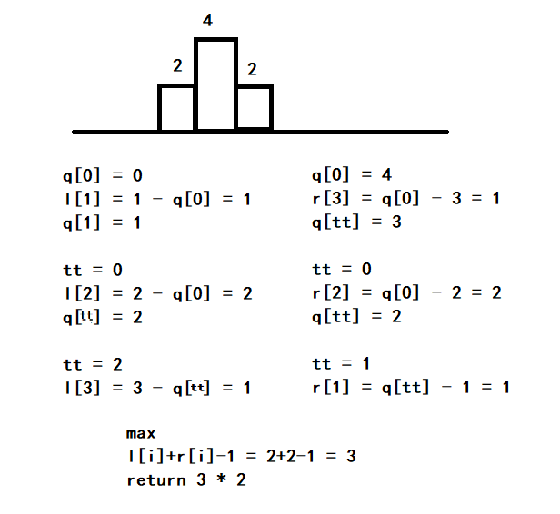


### 单调队列

#### AcWing 154. [滑动窗口](https://www.acwing.com/problem/content/156/)

给定一个大小为 n≤106 的数组。有一个大小为 k 的滑动窗口，它从数组的最左边移动到最右边。你只能在窗口中看到 k 个数字。每次滑动窗口向右移动一个位置。

**输入样例**

```
8 3		//两个整数 n 和 k，分别代表数组长度和滑动窗口的长度
1 3 -1 -3 5 3 6 7
```

**输出样例**

```
-1 -3 -3 -3 3 3		//从左至右，每个位置滑动窗口中的最小值。
3 3 5 5 6 7			//从左至右，每个位置滑动窗口中的最大值。
```

**解析**

```cpp
#include<bits/stdc++.h>
using namespace std;
const int N = 1000010;
int a[N],q[N];
int n,k;
int main()
{
    scanf("%d%d", &n, &k);
    for(int i = 0;i < n;++i)    scanf("%d",&a[i]);
    
    int hh = 0,tt = -1;
    for (int i = 0; i < n; i ++ )
    {
        if(hh <= tt && i-q[hh]+1 > k)   hh++;   	//视情况，或while
        while(hh <= tt && a[q[tt]] >= a[i]) tt--;	//注意是q[tt]而不是q[hh]
        q[++tt] = i;                            	//当前可能为最小值，故应在输出前插入
        if(i+1 >= k)    printf("%d ",a[q[hh]]);		//注意等于号	
    }
    puts("");
    hh = 0,tt = -1;
    for (int i = 0; i < n; i ++ )
    {
        
        if(hh <= tt && i-q[hh]+1 > k)   hh++;
        while(hh <= tt && a[q[tt]] <= a[i]) tt--;
        q[++tt] = i;
        if(i+1 >= k)    printf("%d ",a[q[hh]]);
    }
    
    return 0;
}
```

注释：
```cpp
#include<bits/stdc++.h>
using namespace std;
const int N = 1000010;
int a[N],q[N];      
int n,k;
int main()
{
    scanf("%d%d", &n, &k);
    for(int i = 0;i < n;++i)    scanf("%d",&a[i]);
    
    int hh = 0,tt = -1;     //hh队列头 tt队列尾
    for (int i = 0; i < n; i ++ )
    {
         //维持滑动窗口的大小  判断队头是否已经划出窗口
        if(hh <= tt && i-q[hh]+1 > k)   hh++;           //while亦可，但此题只有一次。不确定可使用while
        while(hh <= tt && a[q[tt]] >= a[i]) tt--;       //单调队列
        //当队列不为空(hh <= tt) 且 当队列队尾元素>=当前元素时,那么队尾元素一定不是当前窗口最小值,删去队尾元素,加入当前元素
        q[++tt] = i;            //q[i]保存的是下标
        if(i+1 >= k)    printf("%d ",a[q[hh]]);     //个数>=k时才输出		
    }
    puts("");
    hh = 0,tt = -1;
    for (int i = 0; i < n; i ++ )
    {
        if(hh <= tt && i-q[hh]+1 > k)   hh++;
        while(hh <= tt && a[q[tt]] <= a[i]) tt--;       //大---->小
        q[++tt] = i;
        if(i+1 >= k)    printf("%d ",a[q[hh]]);			//队头就是最大值
    }
    return 0;
}
```


### KMP

#### AcWing 831. [KMP字符串](https://www.acwing.com/problem/content/833/)

给定一个模式串 S，以及一个模板串 P，所有字符串中只包含大小写英文字母以及阿拉伯数字。模板串 P 在模式串 S 中多次作为子串出现。求出模板串 P 在模式串 S 中所有出现的位置的起始下标。

**输入样例**

```
3
aba
5
ababa
```

**输出样例**

```
0 2
```

**解析**

```cpp
#include <bits/stdc++.h>
using namespace std;
const int N = 100010,M = 1000010;
// int p[N],s[M];
char p[N],s[M];
int n,m;
int ne[N];
int main()
{
    cin >> n >> p+1 >> m >> s+1;
    //求next
    for(int i = 2,j = 0;i <= n;++i)
    {
        while(j && p[i] != p[j+1]) j = ne[j];
        if(p[i] == p[j+1])  j++;
        ne[i] = j;
    }
    //KMP匹配
    for(int i = 1,j = 0;i <= m;++i)
    {
        while(j && s[i] != p[j+1])  j = ne[j];
        if(s[i] == p[j+1])  j++;
        if(j == n)
        {
            printf("%d ",i-n);
            j = ne[j];                  //重新开始匹配时，可以把j最多移动多少
        }
    }
    return 0;
}


//下标从0开始
int main()
{
    cin >> n >> p >> m >> s;
    
    ne[0] = -1;
    //求next
    for(int i = 1,j = -1;i < n;++i)
    {
        while(j != -1 && p[i] != p[j+1]) j = ne[j];
        if(p[i] == p[j+1])  j++;
        ne[i] = j;
    }
    //KMP匹配
    for(int i = 0,j = -1;i < m;++i)
    {
        while(j != -1 && s[i] != p[j+1])  j = ne[j];
        if(s[i] == p[j+1])  j++;
        if(j == n - 1)				//全往前挪了一位
        {
            printf("%d ",i-n + 1);
            j = ne[j];                 
        }
    }
    return 0;
}


```
j = ne[j];————重新开始匹配时，可以把j最多移动多少
 
 

时间复杂度是O(n)。以第二个循环的j为例。j最多加m次,最多减m次.O(2m)----->O(m)。

上述方法所得下标：

| 字符串 | &nbsp;&nbsp;&nbsp; a  b  a    | &nbsp;&nbsp;&nbsp; a  b  a  b  a    |
| :----- | :--------- | :--------------- |
| 下标   | 0  1  2  3 | 0  1  2  3  4  5 |
| next[] | 0  0  1    | 0  0  1  2  3    |

------

**法二**

严版KMP字符串匹配算法 [求next数组](https://www.bilibili.com/video/BV16X4y137qw?from=search&seid=16643420370716168727&spm_id_from=333.337.0.0)（单次匹配）
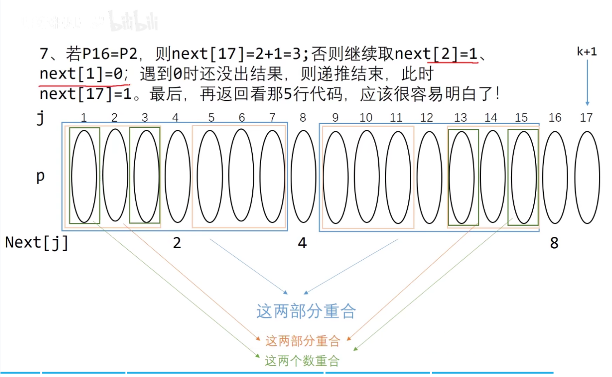 

```cpp
void get_next(String T,int next[])
{
    int i = 1,j = 0;
    next[1] = 0;
    while(i <T.size())
    {
        if(j == 0 || T.ch[i] == T.ch[j])
        {
            ++i;++j;next[i] = j;
        }
        else 
            j = next[j];
    }
}
int Index_KMP(String S,String T,int next[],int pos)
{
    int i = pos,j = 1;
    while(i <= S.size() && j <= T.size())
    {
        if(j == 0 || S.ch[i] == T.ch[j])
        {
            ++i;++j;            //继续比较后继字符
        }
        else
            j = next[j];        //模式串向右移动
    }
    if(j > T.size())
        return i-T.size();  //匹配成功
    else
        return 0;
}
```

上述方法对应next数组

| 字符串 | a  b  a  a  b  c  a  c |
| ------ | ---------------------- |
| 下标   | 1  2  3  4  5  6  7  8 |
| next[] | 0  1  1  2  2  3  1  2 |

推荐 **法一** 。


### Trie

#### AcWing 835. [Trie字符串统计](https://www.acwing.com/problem/content/837/)

维护一个字符串集合，支持两种操作：

1. I x 向集合中插入一个字符串 x；
2. Q x 询问一个字符串在集合中出现了多少次。

共有 N 个操作，输入的字符串总长度不超过 105，字符串仅包含小写英文字母。

**输入样例**

```
5
I abc
Q abc
Q ab
I ab
Q ab
```

**输出样例**

```
1
0
1
```

**解析**

```cpp
#include<bits/stdc++.h>
using namespace std;
const int N = 100010;
int son[N][26],cnt[N],idx;  //下标是0的点，既是根节点，也是空节点
char op[2],str[N];

void insert(char str[])
{
    int p = 0;
    for(int i = 0; str[i]; ++i)
    {
        int u = str[i] - 'a';
        if(!son[p][u])  son[p][u] = ++idx;
        p = son[p][u];
    }
    cnt[p] ++; 
}

int query(char str[])
{
    int p = 0;
    for(int i = 0;str[i];++i)
    {
        int u = str[i] - 'a';
        if(!son[p][u])  return 0;
        p = son[p][u];
    }
    return cnt[p];
}

int main()
{
    int n;
    scanf("%d", &n);
    while (n -- )
    {
        scanf("%s%s", op, str);
        if(op[0] == 'I')    insert(str);
        else if(op[0] == 'Q')   printf("%d\n",query(str));
    }
    return 0;
}

```


#### AcWing 143. [最大异或对](https://www.acwing.com/problem/content/145/)

在给定的 N 个整数 A1，A2……AN 中选出两个进行 xor（异或）运算，得到的结果最大是多少？

**输入样例**

```
3
1 2 3
```

**输出样例**

```
3
```

**解析**

1. 暴力&emsp;O(n) * n

   ```cpp
   int res = 0;
   for(int i = 0;i < n;++i)	//枚举第一个数
   {
   	for(int j = 0;j < i;++j)	//枚举第二个数
       	res = max(res,a[i] ^ a[j]);
   }
   ```

2. 使用Trie树  O(31) * n(十万) ≈ nlogn

   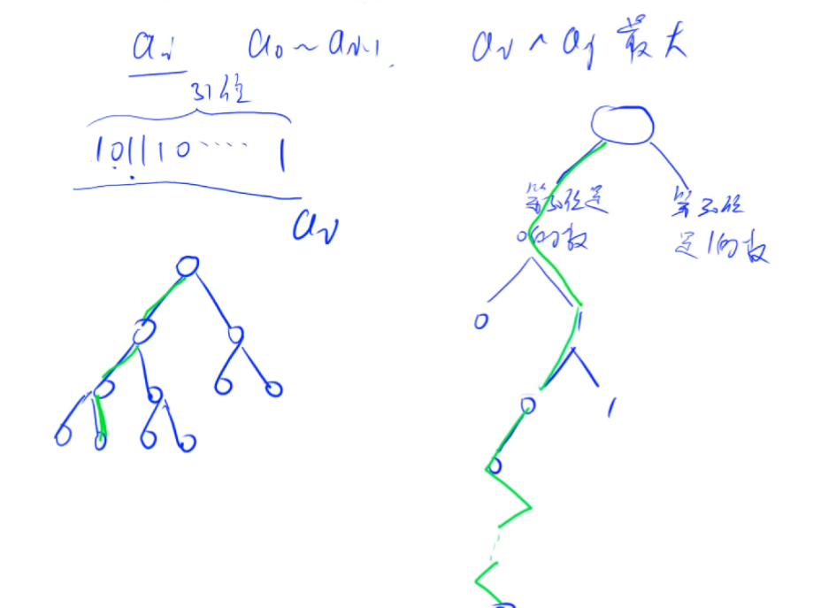

   思路：从前往后枚举，先 **插入** 再 **查询** (也可先查询再插入，但开始空要加判断)。

   ​	查询：查询 ai 前面和 ai 异或最大的值。

   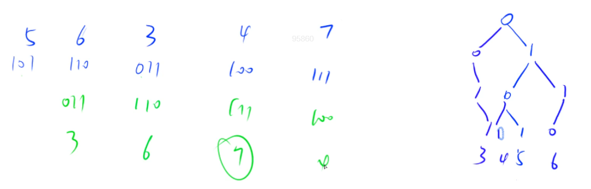

整体代码

```cpp
#include<bits/stdc++.h>
using namespace std;
const int N = 100010, M = 31 * N;
int n,a[N],son[M][2],idx;

void insert(int x)
{
    int p = 0;
    for(int i = 30;i >= 0;--i)
    {
        int u = x >> i & 1;
        if(!son[p][u])             
            son[p][u] = ++idx;
        p = son[p][u];
        /* 循环之内的内容也可以写为
        int &s = son[p][x >> i & 1];
        if (!s) s = ++ idx;
        p = s;
        */
    }
}

int search(int x)
{
    int p = 0,res = 0;
    for(int i = 30;i >= 0;--i)
    {
        int u = x >> i & 1;
        if(son[p][!u])  
        {
            p = son[p][!u];
            res = res * 2 + 1;
        }
        else
        {
            p = son[p][u];
            res = res * 2 ;
        }
    }
    return res;
}

int search2(int x)
{
    int p = 0,res = 0;
    for(int i = 30;i >= 0;--i)
    {
        int u = x >> i & 1;
        if(son[p][!u])  
        {
            res += 1 << i;
            p = son[p][!u];
        }
        else
        {
            p = son[p][u];
        }
    }
    return res;    
}

int main()
{
    scanf("%d", &n);
    for(int i = 0;i < n;++i)
    {
        scanf("%d", &a[i]);
        insert(a[i]);
    }
    int res = 0;
    for(int i = 0;i < n;++i)    
        res = max(res,search2(a[i]));
    printf("%d\n",res);

    return 0;
}
```


### 并查集

#### AcWing 836. [合并集合](https://www.acwing.com/problem/content/838/)

一共有 n 个数，编号是 1∼n，最开始每个数各自在一个集合中。

现在要进行 m 个操作，操作共有两种：

1. M a b，将编号为 a 和 b 的两个数所在的集合合并，如果两个数已经在同一个集合中，则忽略这个操作；
2. Q a b，询问编号为 a 和 b 的两个数是否在同一个集合中。

**输入样例**

```
4 5
M 1 2
M 3 4
Q 1 2
Q 1 3
Q 3 4
```

**输出样例**

```
Yes
No
Yes
```

**解析**

```cpp
#include<bits/stdc++.h>
using namespace std;
const int N = 100010;
int n,m;
int p[N];

int find(int x)     //返回 x 的祖宗节点 + 路径压缩
{
    if(p[x] != x)   p[x] = find(p[x]);
    return p[x];
}

int main()
{
    scanf("%d%d", &n, &m);
    for(int i = 0;i < n;++i)    p[i] = i;
    while (m -- )
    {
        char op[2];
        int a,b;
        scanf("%s%d%d", op,&a, &b);		//同时输入字符串和数字的最合适方法
        if(op[0] == 'M')    p[find(a)] = find(b);
        else if(op[0] == 'Q')  find(a) == find(b) ? puts("Yes") : puts("No");
    }
    return 0;
}
```

> 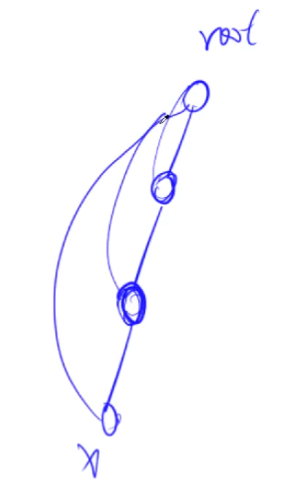
>
> find() 函数 `p[x] = find(p[x])` 在回溯过程中路径压缩优化


#### AcWing 837. [连通块中点的数量](https://www.acwing.com/problem/content/839/)

给定一个包含 n 个点（编号为 1∼n）的无向图，初始时图中没有边。

现在要进行 m 个操作，操作共有三种：

1. C a b，在点 a 和点 b 之间连一条边，a 和 b 可能相等；
2. Q1 a b，询问点 a 和点 b 是否在同一个连通块中，a 和 b 可能相等；
3. Q2 a，询问点 a 所在连通块中点的数量。

**输入样例**

```
5 5
C 1 2
Q1 1 2
Q2 1
C 2 5
Q2 5
```

**输出样例**

```
Yes
2
3
```

**解析**

> 同一个连通块之意：从 a 可以走到 b ，从 b 可以走到 a。

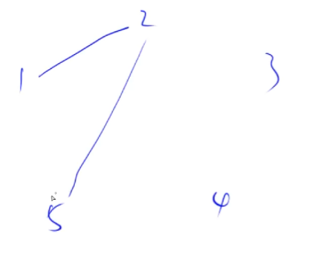

```cpp
#include<bits/stdc++.h>
using namespace std;
const int N = 100010;
int n,m,p[N],cnt[N];

int find(int x)
{
    if(p[x] != x)   p[x] = find(p[x]);
    return p[x];
}

int main()
{
    scanf("%d%d", &n, &m);
    for(int i = 1;i <= n;++i)
    {
        p[i] = i;
        cnt[i] = 1;
    }
    while(m --)
    {
        char op[2];
        int a,b;
        scanf("%s", op);
        if(op[0] == 'C')
        {
            scanf("%d%d", &a, &b);
            if(find(a) == find(b))  continue;
            cnt[find(b)] += cnt[find(a)];
            p[find(a)] = find(b);	
            //若不使用下面的 a = find(a), b = find(b); 上面两个语句次序不能兑换。否则 p[find(a)] 改变值会影响到 cnt[find(a)] 的值。
            
            // cin >> a >> b;
            // a = find(a), b = find(b);
            // if (a != b)
            // {
            //     p[a] = b;
            //     cnt[b] += cnt[a];
            // }
        }
        else if(op[1] == '1')
        {
            scanf("%d%d", &a, &b);
            find(a) == find(b) ? puts("Yes") : puts("No");
        }
        else 
        {
            scanf("%d", &a);
            printf("%d\n",cnt[find(a)]);
        }
    }
    return 0;
}

```


#### AcWing 240. [食物链](https://www.acwing.com/problem/content/242/)

动物王国中有三类动物 A,B,C，这三类动物的食物链构成了有趣的环形。A 吃 B，B 吃 C，C 吃 A。

有人用两种说法对这 N 个动物所构成的食物链关系进行描述：

第一种说法是 `1 X Y`，表示 X 和 Y 是同类。

第二种说法是 `2 X Y`，表示 X 吃 Y。

此人对 N 个动物，用上述两种说法，一句接一句地说出 K 句话，这 K 句话有的是真的，有的是假的。当一句话满足下列三条之一时，这句话就是假话，否则就是真话。

1. 当前的话与前面的某些真的话冲突，就是假话；
2. 当前的话中 X 或 Y 比 N 大，就是假话；
3. 当前的话表示 X 吃 X，就是假话。

你的任务是根据给定的 N 和 K 句话，输出假话的总数。

**输入样例**

```
100 7
1 101 1 
2 1 2
2 2 3 
2 3 3 
1 1 3 
2 3 1 
1 5 5
```

**输出样例**

```
3
```

**解析**

样例图示

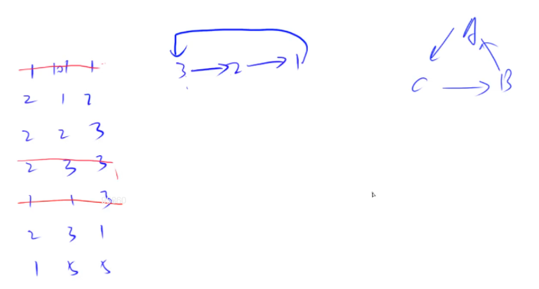

**思路**：

并查集中，维护每个点到根节点的 **距离** 。将距离分为三大类：

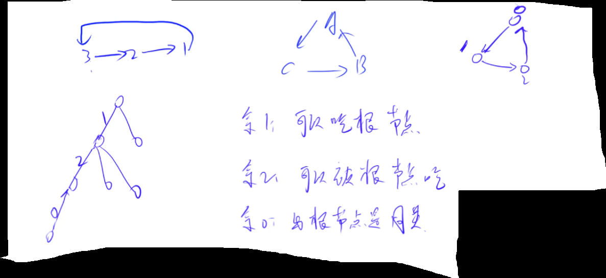

1. 何为距离，即是 `关于代的关系` ，对 **3** 取模以示之。

  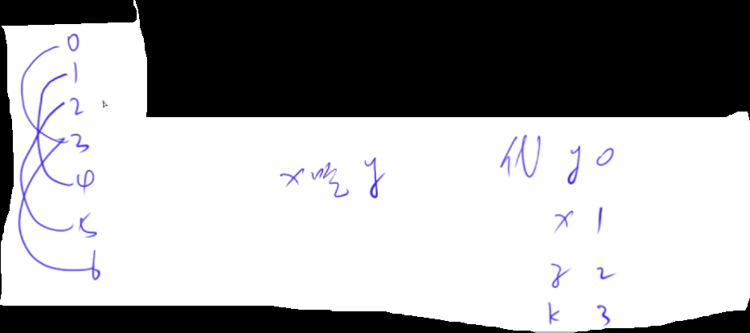

2. 每个点到父节点距离如何维护？

   存的时候存其对父节点距离。在做 **路径压缩** 时，将每个点到 **父节点** 的距离更新成对 **根节点** 的距离。

   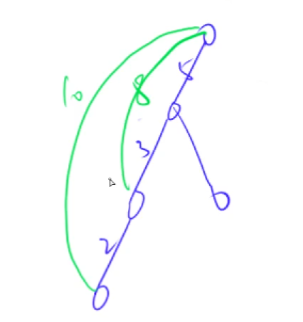

3. 只需要知道每个点与根的关系，即可判断两个点之间的关系。

4. 关于find

5. 存下父节点的根节点；

   再加上父节点到其根节点的距离(把d[x]更新成到根节点的距离)；

   把当前节点的根节点指向最终根节点。

   **d[i]：第 i 个节点到其父节点距离** [ref：find()函数调用过程](https://www.acwing.com/solution/content/15938/)

   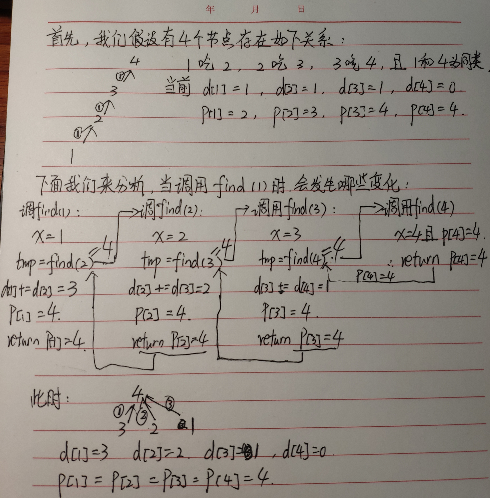

整体代码

```cpp
#include<bits/stdc++.h>
using namespace std;
const int N = 50010;
int p[N],d[N];

int find(int x)
{
    if(p[x] != x)
    {
        int u = find(p[x]);
        d[x] += d[p[x]];
        p[x] = u;
    }
    return p[x];
}
int main()
{
    int n,k;
    cin >> n >> k;

    for(int i = 1;i <= n;++i)   p[i] = i;

    int res = 0;
    while(k --)
    {
        int t,x,y;
        cin >> t >> x >>y;
        if(x > n || y > n)  res++;
        else 
        {
            int px = find(x),py = find(y);
            if(t == 1)
            {
                if(px == py && (d[x]-d[y]) % 3 )  res++;
                else if(px != py)
                {
                    p[px] = py;
                    d[px] = d[y] - d[x];
                }
            }
            else 
            {
                if(px == py && (d[x] - d[y] - 1) % 3 )    res ++;
                else if(px != py)
                {
                    p[px] = py;
                    d[px] = d[y] + 1 - d[x];
                }
            }
        }
    }
    cout << res <<endl;
    return 0;
}
```


### 堆

#### AcWing 838. [堆排序](https://www.acwing.com/problem/content/840/)

输入一个长度为 n 的整数数列，从小到大输出前 m 小的数。

**输入样例**

```
5 3
4 5 1 3 2
```

**输出样例**

```
1 2 3
```

**解析**

```cpp
#include<bits/stdc++.h>
using namespace std;
const int N = 100010;
int n,m,a[N],cnt;

void down(int u)
{
    int t = u;
    if(u*2 <= cnt && a[u*2] < a[t]) t = u*2;
    if(u*2+1 <= cnt && a[u*2+1] < a[t]) t = u*2+1;
    if(u != t)  
    {
        swap(a[u],a[t]);
        down(t);
    }
}

void up(int u)
{
    while(u/2 && a[u/2] > a[u])
    {
        swap(a[u/2],a[u]);
        u /= 2;
    }
}

int main()
{
    scanf("%d%d", &n, &m);
    for(int i = 1;i <= n;++i)   scanf("%d",&a[i]);
    cnt = n;
    for(int i = n/2; i ;--i)    down(i);
    //for(int i = 1; i <= n ;++i)    up(i);
    
    while (m -- )
    {
        printf("%d ",a[1]);
        a[1] = a[cnt];
        cnt --;
        down(1);
    }
    return 0;
}
```


#### AcWing 839. [模拟堆](https://www.acwing.com/problem/content/841/)

维护一个集合，初始时集合为空，支持如下几种操作：

1. `I x`，插入一个数 x；
2. `PM`，输出当前集合中的最小值；
3. `DM`，删除当前集合中的最小值（数据保证此时的最小值唯一）；
4. `D k`，删除第 k 个插入的数；
5. `C k x`，修改第 k 个插入的数，将其变为 x；

现在要进行 N 次操作，对于所有第 2 个操作，输出当前集合的最小值。

**输入样例**

```
8
I -10
PM
I -10
D 1
C 2 8
I 6
PM
DM
```

**输出样例**

```
-10
6
```

**解析**

- 难点

  从第 k 个插入点找到对应元素，又要从堆里的元素找回来。

  ph[k] 与 hp[j] ：`第 k 个插入点的对应下标` 与 `堆中下标为j的点对应的k`。(两者如反函数关系)

  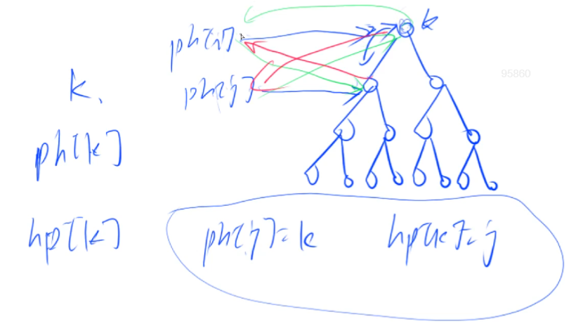

  [如何理解模拟堆中的heap_swap，hp[N\], ph[N]？ - AcWing](https://www.acwing.com/solution/content/5661/)

    1. idx

       `h[k] = x`, h数组存的是节点的值，按理来说应该`h[idx]`来存，但是节点**位置**总是在变的，因此需维护k和idx的映射关系。

       用`ph数组`来表示`ph[idx] = k`(idx到下标), 那么结点值为`h[ph[idx]]`, 儿子为`ph[idx] * 2`和`ph[idx] * 2 + 1`, 这样值和儿子结点通过idx联系在一起。

    2. hp与ph数组

       1. **ph数组** 主要用于帮助从idx映射到下标k；

       2. 在`swap`操作中我们输入是堆数组的下标，需要hp数组方便查找idx。即：

          **hp数组** 查找每个**堆数组的k下标** 对应idx（第idx个**插入**）

    3. 操作实例

       交换函数

       ```cpp
       void heap_swap(int a, int b)
       {
           swap(ph[hp[a]], ph[hp[b]]); 
           swap(hp[a], hp[b]);
           swap(h[a], h[b]);
       }
       ```

       插入

       ```cpp
       if (op == "I")
       {
           scanf("%d", &x);
           size ++ ;
           idx ++ ; 						//记录第几次插入（设置新的idx）
           ph[idx] = size, hp[size] = idx;	//每次插入都是在堆尾插入（设置ph与hp）
           h[ph[idx]] = x; 				//记录插入的值 
           up(ph[idx]);
       }
       ```

       删除

       1. 找到第idx个插入元素在堆数组中的位置（堆数组下标）
       2. 与堆尾元素交换
       3. 在原来第idx个元素所在的位置进行down和up操作。（up，down，swap操作的都输入都是**下标**）

       ```cpp
       if (op == "D")
       {
           scanf("%d", &idx);
           k = ph[idx]; 		//必须要保存当前被删除结点的下标
           heap_swap(k, size);	//第idx个插入的元素移到了堆尾，此时ph[idx]指向堆尾 
           size --;  			//删除堆尾
           up(k);				//k是之前记录被删除的结点的下标
           down(k);
       }
       ```

- 整体代码

  ```cpp
  #include<bits/stdc++.h>
  using namespace std;
  const int N = 100010;
  int h[N],ph[N],hp[N],cnt;

  void heap_swap(int a,int b)
  {
      swap(ph[hp[a]],ph[hp[b]]);
      swap(hp[a],hp[b]);
      swap(h[a],h[b]);
  }

  void down(int u)
  {
      int t = u;
      while(u*2 <= cnt && h[u*2] < h[t])   t = u*2;
      while(u*2+1 <= cnt && h[u*2+1] < h[t])   t = u*2+1;
      if(u != t)  
      {
          heap_swap(u,t);
          down(t);
      }
  }

  void up(int u)
  {
      while(u/2 && h[u/2] > h[u])
      {
          heap_swap(u/2,u);
          u /= 2;
      }
  }

  int main()
  {
      int n,m = 0;
      scanf("%d", &n);
      while (n -- )
      {
          char op[5];
          int x,k;
          scanf("%s", op);
          if(!strcmp(op, "I"))
          {
              scanf("%d",&x);
              cnt ++;
              m ++;
              ph[m] = cnt,hp[cnt] = m;
              h[cnt] = x;
              up(cnt);
          }
          else if(!strcmp(op, "PM"))
          {
              printf("%d\n",h[1]);
          }
          else if(!strcmp(op, "DM"))
          {
              heap_swap(1,cnt);
              cnt --;
              down(1);
          }
          else if(!strcmp(op, "D"))
          {
              // scanf("%d", &k);
              // heap_swap(ph[k],idx);
              // idx --;
              // down(ph[k]),up(ph[k]);	//0223这么做错误,k已经改变
              scanf("%d", &k);
              k = ph[k];              	//0216遗漏
              heap_swap(k,cnt);
              cnt --;
              down(k),up(k);				//这两个函数有且只有一个执行
          }
          else if(!strcmp(op, "C"))
          {
              scanf("%d%d", &k, &x);
              k = ph[k];
              h[k] = x;
              down(k),up(k);
          }
      }
      return 0;
  }
  ```


### 哈希表

#### AcWing 840. [模拟散列表](https://www.acwing.com/problem/content/842/)


#### AcWing 841. [字符串哈希](https://www.acwing.com/problem/content/843/)


chapter 2 END。